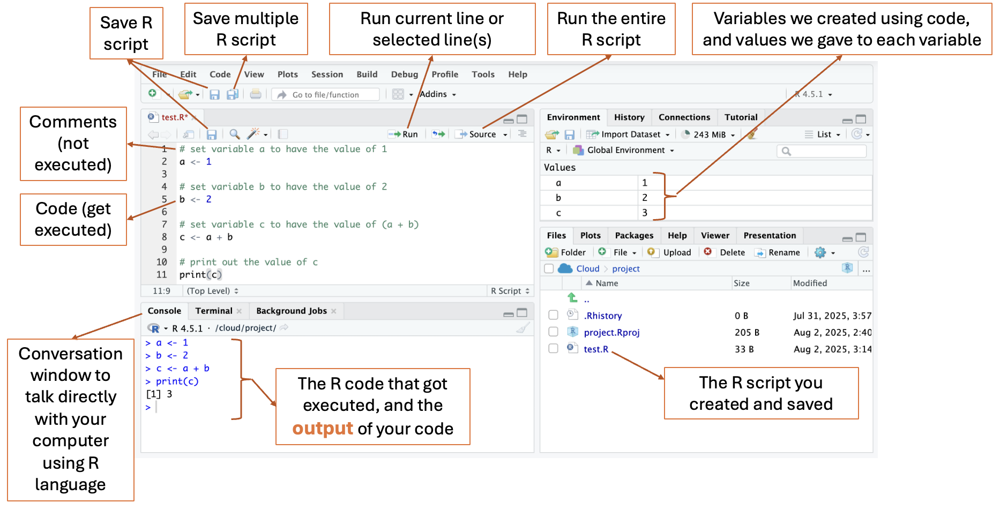

# 🏰 Day 1: Basic Programming Magic in R

*Welcome to the Magic Castle where Oda the Otter teaches you the secret spells of programming!*


```{image} ../../images/logo2.png
:alt: logo2
:width: 50%
```

## 🔮 Learning Journey Overview

Today we'll join Oda on our first adventure into the magical world of R programming! By the end of today, you'll be casting spells with code and making smart decisions like a real data wizard.

### 🎯 Learning Objectives
- 🔤 Write your first lines of R code
- 📝 Understand comments and why they're important
- 🎲 Master variables and data types
- 🔄 Control program flow and have computers make decisions using if-else conditions


---

## 👋 Let's Get to Know Each Other!


#### 🎨 Two Truths and a Creative Lie
*Duration: 10 minutes*

How to Play:
1. For small groups of 4-5 people. Try to sit with people you don't know very well!

2. Each person shares 3 things about themselves:
   - ✅ Two TRUE things (real facts about you)
   - 🎭 One CREATIVE LIE (something fun and silly that you made up)

3. Examples to get you started:
   - "I have a pet turtle named Mr. Speedy"
   - "I can speak three languages"
   - "I once ate 15 pancakes in one sitting"
   - "My favorite color changes every Tuesday"

4. Guess the lie! After each person shares, everyone else tries to figure out which one is the creative lie.

5. Reveal the lie! Share which was the lie and tell the real story behind your truths.

---

## 1. 🗿 Building Our Magical World
*Duration: 35 minutes*

Before we can start our programming adventure, we need to set up our magical coding environment! Think of this like building a castle where all our R magic will live.

### 🏰 Step 1: Create Your Coding Castle
*Duration: 10 minutes*

Head over to our [Posit Cloud Setup Guide](../setup/posit-cloud-setup.md) and create your castle.

💡 **Important**: Complete the Posit Cloud setup before continuing with today's activities. This is where all your magical data science adventures will start! ✨

### ☁️ Step 2: Learning more about Posit Cloud (same as R Studio interface)
*Duration: 5 minutes*

**The Magic Interface**

- **📝 Editor (top left):** Your magical scroll for writing longer R spells (code).
- **🔮 Console (bottom left):** Cast spells (code) here and see the magic happen instantly!
- **🌳 Environment (top right):** All the magical creatures (variables, data) you create will live here.
- **🗺️ Files & Plots (bottom right):** Find your project files and see the beautiful plots/graphs you create.



### 🖨️ Step 3: Practice Print Statement
*Duration: 10 minutes*

#### 🎈 Activity: Magical Print Adventure!

Time to practice your first spell - the `print()` command! This magical spell makes words appear on your screen.

**How to cast the spell:**
1. In the Console (bottom left), type: `print("Write down what you want to say!")`
2. Press **Enter** and watch the magic happen! ✨

Some print ideas:
- `print("My name is [YOUR NAME]")`
- `print("🦦 Oda the Data Otter says hi!")`
- `print("Fun fact: Otters hold hands when they sleep!")`
- `print("✨ I can make the computer talk to me! ✨")`
- `print("🎉 This is my first day as a data scientist! 🎉")`

**💡 Pro Tips:**
- Don't forget the quotation marks " " around your text!
- You can use emojis to make your messages more fun
- Each print statement creates a new line

**🐛 Common Mistake:** 
- Forgetting the quotation marks - R needs them to know it's text!
- Forgetting the right parenthesis - R needs () both, like minions has 2 arms, it needs 2 arms to hug your sentence!


### 📜 Step 4: Write Your First Magical scroll ✨
*Duration: 10 minutes*

Ready to write your first piece of R code? We call them scripts, but think of them as magical scrolls!

1. Create Your Scroll
- In the top-menu, click **File** -> **New File** -> **R Script**.
- A blank page will appear. This is where you'll write your spell!

2. Save Your Scroll
- Click the blue save icon (💾).
- Name your file `my_first_spell.R` (or any other name you like) and click **Save**.

3. Write Your Spell
- Copy and paste the code below into your new scroll:
```R
# set variable a to have the value of 1
a <- 1

# set variable b to have the value of 2
b <- 2

# set variable c to have the value of (a + b)
c <- a + b

# print out the value of c
print(c)
```

4. Cast Your Spell!

There are a few ways to run your code:

- Run one line at a time:
  - Click on the line of code you want to run.
  - Click the **Run** button, or press `Ctrl+Enter` (Windows) or `Cmd+Enter` (Mac).
  - This is great for testing your spell line-by-line!

- Run a chunk of code:
  - Highlight the lines you want to run with your mouse.
  - Click the **Run** button at the top-right of your script editor.
  - You will see the result in the Console below.

- Run the whole script (Source):
  - Click the **Source** button to run everything in your file at once. It's like casting a big, powerful spell!
  - You should see the number `3` appear in the console. You just did magic with code!


---

## 2. 🧙‍♀️ Understanding Your First Magical Scroll
*Duration: 35 minutes*

Great job creasting your first magical scroll! But what exactly happened? Let's break down the magic step by step.

### 2.1 💬 Comments: Messages to Future You
*Duration: 5 minutes*

First, notice the lines that start with `#`. These are called **comments**:

```R
# set variable a to have the value of 1
```

💡 **What are comments?**
- Comments are notes you write to yourself (and others) to explain what your code does
- The computer ignores everything after the `#` symbol
- Think of them as sticky notes on your magical scrolls!

🤔 Why use comments?
- They help you remember what you were thinking
- They help others understand your magic
- They make finding and fixing mistakes easier!

🎈 Try this: 
- Add a comment to your spell that says what the final answer should be!
- Add a comment at the begining of the magical scroll to sign your name:
```R
# This magical scroll belongs to: YOUR NAME
```

### 2.2 🏷️ Variables: Magical Storage Boxes
*Duration: 5 minutes*

The real magic happens with **variables**. Think of variables as magical storage boxes with labels:

```R
a <- 1    # Put the number 1 in a box labeled "a"
b <- 2    # Put the number 2 in a box labeled "b"
c <- a + b # Take what's in box "a" and "b", add them, put result in box "c"
```

The `<-` symbol is like an arrow pointing into the box. It means "store this value here."

### 2.3 🏷️ Variable Naming: Like Naming Your Pet!
*Duration: 5 minutes*

In everyday life, we give names to complicated things to make talking easier. Instead of saying "that furry animal with 4 legs that barks and wags its tail," we just say "dog!" 

In R, we do the same thing with data - we give it names so we can use it easily later.

```R
result <- 3*2 + 5
result
# [1] 11
```

When R runs this code, it first calculates `3*2 + 5` (which equals 11), then stores that number in a box labeled `result`.

**💡 Variable Naming Rules:**
- Can use letters (A-Z, a-z), numbers, underscores (_), and dots (.)
- Cannot start with a number** (like `2cats` ❌)
- Cannot have spaces (use `my_cat` not `my cat` ❌)
- Case matters - `Result` and `result` are different!

**💡 Good naming style (like good pet names!):**
- Use lowercase letters: `my_age` ✅
- Use underscores for spaces: `favorite_color` ✅  
- Make names meaningful: `student_count` ✅ (not just `a`, or `b` ❌)

### 2.4 🌊 Data Types: The Four Magical Islands
*Duration: 15 minutes*

Just like Oda's ocean has different islands 🏝️, R has different types of data. Here are 4 data types that Oda commonly use in her otterly beautiful data adventures :

1. **🔢 Integer Island** - Whole numbers (1, 5, 100)
2. **🧮 Numeric Island** - Decimal numbers (1.5, 3.14, 2.7)  
3. **📝 Character Island** - Words and letters ("hello", "Oda", "let's go swim!")
4. **✅ Logical Island** - True or False (TRUE, FALSE)


#### 🎈 Activity: Data Islands Adventure!

Time to explore the data islands! We'll divide the room in half and create a magical data world.

Setup:
- Half the room = Variable Boxes
  - students get empty boxes
  - ‼️ TODO: Students please write your own variable names on the box
- Half the room = Values (will get cards after forming islands)

##### Round 1: Form the Data Islands
1. Value students form four islands in 4 groups:
   - Integer Island (whole numbers)
   - Numeric Island (decimal numbers)  
   - Character Island (words)
   - Logical Island (TRUE/FALSE)
2. Instructor gives out blank value cards to each island
3. ‼️ TODO: Students please write your own values based on your island type:
   - Integer Island: whole numbers (e.g., 1, 5, 10, 25)
   - Numeric Island: decimal numbers (e.g., 1.5, 3.14, 2.7, 5.8)
   - Character Island: words (e.g., "Oda", "magic", "otter", "data")
   - Logical Island: TRUE or FALSE

##### Round 2: Variable Assignment
1. Variable students and Value students voluntarily match up (one-to-one pairs)
2. Each pair links arms and practices saying: "I am [variable name] and I store [value]!"
3. Make sure everyone has a partner before moving on!

##### Round 3: Magical Calculations
1. Instructor holds a calculation box labeled `result`
2. Simple addition: "Add up all students from Integer Island!"
3. Variable + Value pairs come together and hold hands
4. Instructor gets the final answer and becomes e.g., `result <- 41`

##### Round 4: Variable Updates
1. Update a variable: "box_1, please throw away your old value, you now store 100."
2. Repeat the calculation - different result!
3. **Important lesson:** Variables can change, calculations give new results!

##### Round 5: Order of Operations Magic
1. Big calculation: `result <- 4 + 3*4`
2. Show the steps:
   - First: `3*4` students hold hands → make 12
   - Then: `4 + 12` → make 16  
   - Finally: assign 16 to `result`
3. **Key lesson:** Multiplication happens before addition, before value assignment to variables!


### 2.5 💥 Errors
*Duration: 5 minutes*

🐛 **Don't worry - Everyone makes mistakes when coding!**


R is like learning a new language! Just like human languages, R has rules. But R is different from human languages in two important ways:

1. *The rules are simple* - You can learn most of them in just a few weeks!
2. *The rules are strict* - Unlike humans who can understand you even with small mistakes, computers need you to follow the rules exactly.

Even Oda the Otter makes mistakes when casting data spells! When you forget something in your code, R will show you an error message to help you fix it.

#### 🎈 Activity: Let's try making a mistake on purpose:

In the Console, try typing this broken spell:
```R
print("My favorite number is " + 1)
```

*What happened?*
- R shows you an error message like "non-numeric argument to binary operator"
- This means you can't add text ("My favorite number is ") and numbers (1) together - they're different types!

*How to fix it:*
```R
print("My favorite number is 1")  # ✨ Now it works!
```

**💡 Common Beginner Mistakes:**
- Forgetting the closing `)` parenthesis
- Forgetting quotation marks `"`
- Mixing up different data types

**🎯 The Most Important Skill: Debugging!**
Learning to find problems, fix them, and move on is one of the MOST important skill in coding. Even your instructor makes errors every day!

This skill will make you a coding superhero! 🦸‍♀️🦸‍♂️

#### 🤡 Fun Fact: Why are errors in code called bug?
*Because it was actually a BUG...*

In 1947, computer scientist Grace Hopper found an actual moth stuck in a the powerful computer Mark II at Harvard, which caused the computer to break down! She taped it in her logbook and wrote "First actual case of bug being found." Since then, we call computer problems "bugs" and fixing them "debugging"! 🐛

```{image} ../../images/bug.png
:alt: bug
:width: 60%
```

#### **💡 Pro Tips:**
- 💾 **Save your work often!** Click the save icon or press `Ctrl+S` (Windows) / `Cmd+S` (Mac).
- 🐛 Errors are okay! They are just clues to help you learn and fix your spell.
- 🌈 Make your code colorful! Rainbow parentheses help you see where code blocks start and end. Here's how to turn them on:
  1. Go to **Tools** -> **Global Options**.
  2. Click **Code** on the left.
  3. Go to the **Display** tab on the top.
  4. Check the box for **Use rainbow parentheses**.
  5. Click **Apply**!
- 📝 Name things like a wizard! Good names help you remember what your magical creatures (variables) do:
  - Use `snake_case` or `kabab-case` (like `my_age` or `favorite-color`)
  - Always start with a letter, never a number (✅ `age1` ❌ `1age`)
  - Only use lowercase letters, numbers, and `-` or `_`
  - Make names short but meaningful (this is hard but important!)

#### **🆘 Troubleshooting**

##### "object 'my_variable' not found"
- What it means: You tried to use a magical creature (variable) that R doesn't know about.
- Why it happens:
  - You forgot to create your variable first (like `my_variable <- 10`)
  - You have a typo in the name
- The Fix: Run the line that creates your variable first, then check your spelling!

##### Case-Sensitivity Chaos
- What it means: R thinks `MyData` and `mydata` are totally different things.
- Why it happens: R is picky about capital letters.
- The Fix: Always spell your variables exactly the same way - capitals matter!

##### Missing Parentheses or Quotes: ( or "
- What it means: You opened something but forgot to close it.
- Why it happens: Easy to forget!
- The Fix: Count your `(` and `)`, and your `"` marks. The rainbow parentheses we turned on help you see which ones match!

---

## 3. 🪄 Making Magical Decisions: If-Else Adventures
*Duration: 95 minutes*

Welcome to the next magical part of programming - teaching your code to make decisions! Just like Oda the Otter decides whether to swim upstream or downstream based on the current, our code can make choices too! 🦦✨

### 3.1 🎈 Activity: The Magic Color Decision Game
*Duration: 15 minutes*

Before we write code, let's experience how decision-making works for humans using our voice and body!

#### How to Play:
1. Look at your shirt color
2. Follow Oda's Magic Rules:

##### Round 1: Simple If-Else
- **IF** you're wearing WHITE → "Roar like a lion!" 🦁
- **ELSE** → "Swim like an otter!" 🦦 

```R
# 🔮 Simple if-else decision
shirt_color <- "white"  # Try changing to other colors!

if (shirt_color == "white") {
  print("🦁 Roar like a lion!")
} else {
  print("🦦 Swim like an otter!")
}
```

##### Round 2: OR condition
- **IF** you're wearing WHITE **or** BLUE → "Roar like a lion!" 🦁
- **ELSE** → "Swim like an otter!" 🦦 

```R
# 🔮 OR condition decision
shirt_color <- "blue"  # Try "white", "blue", or "red"

if (shirt_color == "white" | shirt_color == "blue") {
  print("🦁 Roar like a lion!")
} else {
  print("🦦 Swim like an otter!")
}
```

##### Round 3: AND condition
- **IF** you're wearing WHITE **and** BLUE → "Roar like a lion!" 🦁
- **ELSE** → "Swim like an otter!" 🦦 

```R
# 🔮 AND condition decision (need BOTH colors)
shirt_color <- "white"
pants_color <- "blue"

if (shirt_color == "white" & pants_color == "blue") {
  print("🦁 Roar like a lion!")
} else {
  print("🦦 Swim like an otter!")
}
```

##### Round 4: If-ElseIf-Else
- **IF** you're wearing BLACK → "Bark like a dog!" 🐶
- **ELSE IF** you're wearing BLUE → "Hop like a bunny!" 🐰 
- **ELSE** → "Moo like a cow!" 🐮

```R
# 🔮 Multiple condition decision
shirt_color <- "black"  # Try "black", "blue", or "red"

if (shirt_color == "black") {
  print("🐶 Bark like a dog!")
} else if (shirt_color == "blue") {
  print("🐰 Hop like a bunny!")
} else {
  print("🐮 Moo like a cow!")
}
```

##### Round 5: No Else (Some people might not do anything!)
- **IF** you're wearing BLACK → "Bark like a dog!" 🐶
- **ELSE IF** you're wearing BLUE → "Hop like a bunny!" 🐰 

```R
# 🔮 No "else" - some conditions don't trigger any action
shirt_color <- "red"  # Try "black", "blue", or "red"

if (shirt_color == "black") {
  print("🐶 Bark like a dog!")
} else if (shirt_color == "blue") {
  print("🐰 Hop like a bunny!")
}
# Notice: No "else" - if wearing red, nothing happens!
```

##### Round 6: Multiple actions
- **IF** you're wearing BLACK → Stand up → "Bark like a dog!" 🐶
- **ELSE IF** you're wearing BLUE → Hands in the air → "Hop like a bunny!" 🐰 
- **ELSE** → cover your eyes → "Moo like a cow!" 🐮

```R
# 🔮 Multiple actions in each condition
shirt_color <- "black"  # Try different colors

if (shirt_color == "black") {
  print("🧍 First, I stand up!")
  print("🐶 Then I bark like a dog!")
} else if (shirt_color == "blue") {
  print("🙌 First, hands in the air!")
  print("🐰 Then hop like a bunny!")
} else {
  print("🙈 First, I cover my eyes!")
  print("🐮 Then moo like a cow!")
}
```

#### 💡 **What Did We Learn?**
- Decisions follow a pattern: Check a condition → Do 1 or more action(s)
- We can combine conditions with **OR** (`|`) and **AND** (`&`)
- We can have multiple conditions with **"else if"**
- We can have a backup plan with **"else"** - but it's optional!
- We can do multiple actions inside each condition
- Only ONE path gets chosen - just like only one group of people did each action!

### 3.2 🖥️ Coding Magic: Teaching R to Make Decisions
*Duration: 40 minutes*

Now let's teach R the same decision-making magic! In your R script, try these spells:

#### ✨ Spell 1: Simple If-Else Magic
📁 **Find this spell in Posit Cloud:** Look for the file `day01_spell01_simple_if_else.R` in your project files!

```R
# 🔮 Oda's first decision spell
my_favorite_number <- 7

if (my_favorite_number > 5) {
  print("🎉 Wow! That's a big number!")
} else {
  print("💭 That's a nice small number!")
}
```

##### 🎈 Activity: Try It Yourself!
1. Change `my_favorite_number` to different values (try 3, 10, 1)
2. Run the code each time - what happens?
3. **Challenge:** Can you predict the message before running it?

#### ✨ Spell 2: Multiple Choices (If-ElseIf-Else)
📁 **Find this spell in Posit Cloud:** Look for the file `day01_spell02_multiple_choices.R` in your project files!

```R
# 🌈 Oda's color mood detector
favorite_color <- "blue"

if (favorite_color == "red") {
  print("🔥 You like bold and exciting adventures!")
} else if (favorite_color == "blue") {
  print("🌊 You love calm and peaceful vibes!")
} else if (favorite_color == "green") {
  print("🌱 You enjoy nature and growing things!")
} else {
  print("✨ You have a unique and magical taste!")
}
```

##### 🎈 Activity: Customize Your Color Magic!
1. Change `favorite_color` to your actual favorite color
2. If your color isn't there, what message do you get?
3. **Extension:** Add your favorite color with a special message!

#### ✨ Spell 3: Number Range Detective
📁 **Find this spell in Posit Cloud:** Look for the file `day01_spell03_number_range.R` in your project files!

```R
# 🔍 Oda's number detective game
mystery_number <- 4

if (mystery_number < 10) {
  print("🐣 Tiny number - like a baby otter!")
} else if (mystery_number < 50) {
  print("🦦 Medium number - like a young otter!")
} else if (mystery_number < 100) {
  print("🏔️ Big number - like a mountain otter!")
} else {
  print("🚀 Huge number - like a space otter!")
}
```

##### 🎈 Activity: Number Range Challenge!
1. Try these mystery numbers: 5, 25, 75, 150
2. **Predict first:** Which otter will you get for each number?
3. **Challenge:** What happens if you use 0 or negative numbers?


#### ✨ Spell 4: AND Condition Magic (Both Things Must Be True!)
📁 **Find this spell in Posit Cloud:** Look for the file `day01_spell04_and_condition.R` in your project files!

```R
# 🎭 Oda's perfect day detector
temperature <- 25
weather <- "sunny"

if (temperature > 20 & weather == "sunny") {
  print("🏖️ Perfect day for swimming and playing!")
  print("🦦 Oda is super happy!")
} else {
  print("🏠 Maybe it's a good day to stay inside and code!")
}
```

##### 🎈 Activity: Weather Wizard!
1. Try these combinations and see what Oda does:
   - `temperature <- 15` and `weather <- "sunny"`
   - `temperature <- 25` and `weather <- "rainy"`
   - `temperature <- 30` and `weather <- "sunny"`

#### ✨ Spell 5: OR Condition Magic (Either Thing Can Be True!)
📁 **Find this spell in Posit Cloud:** Look for the file `day01_spell05_or_condition.R` in your project files!

```R
# 🍎 Oda's snack time detector
snack <- "apple"

if (snack == "apple" | snack == "banana" | snack == "carrot") {
  print("🥰 Yummy! Oda loves healthy snacks!")
  print("💪 This will give me energy for coding!")
} else if (snack == "cookie" | snack == "candy") {
  print("🍪 Sweet treat! But just a little bit!")
} else {
  print("🤔 Hmm, Oda isn't sure about this snack...")
}
```

##### 🎈 Activity: Snack Sorter!
1. Test with these snacks: "apple", "cookie", "pizza", "banana"
2. **Extension:** Add your favorite snack to one of the categories!
3. **Question:** What happens if you type "Apple" with a capital A?

#### ✨ Spell 6: Age Group Sorter (Like the Physical Activity!)
📁 **Find this spell in Posit Cloud:** Look for the file `day01_spell06_age_groups.R` in your project files!

```R
# 🎂 Oda's age group magic (just like our shirt color game!)
age <- 4

if (age < 6) {
  print("🐣 Little explorer - just starting the adventure!")
} else if (age >= 6 & age <= 9) {
  print("🧸 Young adventurer - ready for fun!")
} else if (age >= 10 & age <= 14) {
  print("🧙‍♀️ Data wizard in training - that's you!")
} else if (age >= 15 & age <= 18) {
  print("🚀 Teen tech master - almost ready to rule the world!")
} else {
  print("🎓 Wise adult - teaching the next generation!")
}
```

##### 🎈 Activity: Age Detective Challenge!
1. Try your real age and see what message you get!
2. Try ages: 5, 8, 12, 16, 25
3. Family Fun: Try your family members' ages!

#### ✨ Spell 7: Multiple Actions Spell (Do Several Things!)
📁 **Find this spell in Posit Cloud:** Look for the file `day01_spell07_multiple_actions.R` in your project files!

```R
# 🎪 Oda's magic show with multiple tricks
magic_word <- "abracadabra"

if (magic_word == "abracadabra") {
  print("✨ *Sparkles appear in the air*")
  print("🎩 *A rabbit pops out of the hat*")
  print("🌟 *The crowd cheers loudly*")
  print("🦦 Oda takes a bow!")
} else if (magic_word == "alakazam") {
  print("💥 *Thunder sound effect*")
  print("🎆 *Colorful fireworks explode*")
  print("🦦 Oda does a backflip!")
} else {
  print("😅 Oops! That's not a magic word Oda knows...")
  print("💡 Try 'abracadabra' or 'alakazam'!")
}
```

##### 🎈 Activity: Build Your Own Magic Show!
1. Try both magic words and see the different shows!
2. **Creative Challenge:** Add a third magic word with your own magic show!
3. **Question:** Why do we use multiple `print()` statements?


#### ✨ Spell 8: No Else Challenge (Sometimes Nothing Happens!)
📁 **Find this spell in Posit Cloud:** Look for the file `day01_spell08_no_else.R` in your project files!

```R
# 🏆 Oda's achievement unlocked detector
points <- 85

if (points >= 100) {
  print("🏆 LEGENDARY! You're a coding master!")
}

if (points >= 75) {
  print("⭐ AWESOME! You're doing great!")
}

if (points >= 50) {
  print("👍 GOOD JOB! Keep practicing!")
}

# Notice: No "else" - you might get multiple messages!
print(paste("🎯 You have", points, "points total!"))
```

##### 🎈 Activity: Achievement Hunter!
1. Try these point values: 30, 60, 80, 120
2. **Question:** Why might someone get multiple achievement messages?
3. **Challenge:** What's the minimum points to get all three achievements?


### 3.3 🎯 The Magic of Code Order!
*Duration: 15 minutes*

#### 💡 Why Sequence Matters in Magic Spells!
Just like Oda must perform her magic spells in the right order, **the sequence of code matters!** Let's discover why with some magical experiments!

#### ✨ Spell 9A: Order Matters - The Racing Game!
📁 **Find this spell in Posit Cloud:** Look for the file `day01_spell09A_code_order.R` in your project files!

```R
# 🏁 Oda's magical racing game - Position matters!
position <- 2

# Version 1: Check from FIRST place to LAST place
if (position == 1) {
  print("🥇 GOLD MEDAL! You're the champion!")
} else if (position == 2) {
  print("🥈 SILVER MEDAL! Amazing job!")
} else if (position == 3) {
  print("🥉 BRONZE MEDAL! Great effort!")
} else {
  print("👏 Good race! Keep practicing!")
}
```

#### ✨ Spell 9B: Wrong Order - The Broken Magic!

📁 **Find this spell in Posit Cloud:** Look for the file `day01_spell09B_code_order.R` in your project files!

```R
# ⚠️ What happens if we check from LAST place to FIRST place?
position <- 2

# Version 2: This might not work as expected!
if (position >= 1) {  
  print("👏 Good race! Keep practicing!")
} else if (position == 1) {  
  print("🥇 GOLD MEDAL! You're the champion!")
} else if (position == 2) {  
  print("🥈 SILVER MEDAL! Amazing job!")
}
```

##### 🎈 Activity: Code Detective!
1. Try both versions with position = 1, 2, and 3
2. **Question:** Why does Version 2 always say "Good race!" even for 1st place?
3. **Discovery:** Which conditions will NEVER run in Version 2 and why?

#### ✨ Spell 10: String Detective (Text Comparison Magic!)
📁 **Find this spell in Posit Cloud:** Look for the file `day01_spell10_string_detective.R` in your project files!

```R
# 🔍 Oda is trying to find a old friend of her, whose name is Mike
name <- "Mike"

if  (nchar(name) <= 4){
  print("📝 You have a nice short name!")
} else if (name == "mike" | name == "Mike" | name == "Michael" | name == "michael"){
  print("👥 Hi Mike, long time no see! I've caught some clams today! 🌊 🐚 🦪")
} else if (nchar(name) >= 8) {
  print("📚 Wow! You have a beautifully long name!")
} else {
  print("✨ You have a perfectly medium-sized name!")
}

# Bonus: Count the letters in your name!
print(paste("🔢 Your name has", nchar(name), "letters!"))
```

##### 🎈 Activity: Name Explorer!
1. Try your real name and see what category you get!
2. Try these names: "Jo", "Elizabeth", "Sam", "Christopher"
3. **Question:** What does `nchar()` do? Try it with different words!
4. **Challenge:** Why can't Oda ever find Mike? Can you fix this code so that Oda can find Mike?


#### 🎉 **Congratulations! You're a Decision-Making Wizard!**

#### ✨ **Creative Extension Ideas:**
- Create a "What should I wear today?" decision tree using temperature ranges
- Build a "What's my spirit animal?" quiz using age ranges
- Make a "How many hours of sleep do I need?" advisor using age groups
- Design a "What sport should I try?" recommender using height ranges


### 3.4 🧠 Understanding Decision Logic
*Duration: 5 minutes*

#### The Magical Comparison and Condition Symbols:
- `==` means "is exactly equal to" (like twin otters! 🦦 == 🦦)
- `>` means "is greater than" (elephant is larger than otter 🐘 > 🦦)
- `<` means "is less than" (mouse is smaller than otter! 🐭 < 🦦)
- `>=` means "greater than or equal to" 
- `<=` means "less than or equal to"
- `!=` means "is NOT equal to" (otters are different from birds! 🦦 != 🐧)
- `|` means "or" (I would like to meet Mr. Fish or Mrs. Oda today: 🐟 or 🦦)
- `&` means "and" (I like otter and elephant 🐘 & 🦦)

#### ✨ Spell 11: Temperature Zone Detective (Real World >= <= Examples!)
📁 **Find this spell in Posit Cloud:** Look for the file `day01_spell11_temperature_zones.R` in your project files!

```R
# 🌡️ Oda's temperature zone detector
temperature <- 22  # In Celsius

if (temperature <= 0) {
  print("🧊 FREEZING! Time for hot cocoa and warm blankets!")
  print("🦦 Oda is wearing a thick winter coat!")
} else if (temperature >= 1 & temperature <= 10) {
  print("🥶 COLD! Perfect sweater weather!")
} else if (temperature >= 11 & temperature <= 20) {
  print("😊 COOL! Great for a light jacket!")
} else if (temperature >= 21 & temperature <= 30) {
  print("☀️ WARM! Perfect for playing outside!")
} else if (temperature >= 31) {
  print("🔥 HOT! Time for swimming and ice cream!")
  print("🦦 Oda jumps in the river to cool off!")
} else {
  print("🤔 Something seems fishy with this temperature...")
}
```

##### 🎈 Activity: Weather Station!
1. Try these temperatures: -5, 5, 15, 25, 35
2. **Real World:** Check today's actual temperature and see what Oda says!
3. **Question:** Why do we use `>=` and `<=` instead of just `>` and `<`?
4. **Errors:** What input would cause R to generate errors?

### 3.5 🎮 Challenge: Build Your Own Decision Tree!
*Duration: 15 minutes*

Create a magical creature classifier! Copy this code and fill in the blanks:

#### ✨ Spell 12: Magical creature detector!
📁 **Find this spell in Posit Cloud:** Look for the file `day01_spell12_magical_creatures.R` in your project files!

```R
# 🦄 Magical Creature Classifier
creature_size <- 50   # Size in cm - Try: 10, 50, 200
creature_color <- "purple" # Try: "purple", "gold", "rainbow"

if (creature_size <= 20) {
  if (creature_color == "purple") {
    print("🧚‍♀️ You found a tiny fairy!")
  } else {
    print("🐛 You found a magical bug!")
  }
} else if (creature_size >= 21 & creature_size <= 100) {
  if (creature_color == "purple") {
    print("🦄 You found a unicorn!")
  } else if (creature_color == "gold") {
    print("🐉 You found a baby dragon!")
  } else {
    print("🦦 You found Oda the Otter!")
  }
} else if (creature_size >= 101) {
  print("👹 You found a friendly giant!")
}

```

##### 🎈 Activity: Create your own creature:**
1. Try different combinations of `creature_size` (15, 50, 150) and `creature_color`
2. Add a new size range (maybe 101-300 for "large" creatures) with your own magical creature
3. Add a new color option with your own special message
4. **Challenge:** What happens if you use negative numbers or zero for size?

##### 🎈 Activity: Have your friends try to find creatures in your code!


### 3.6 🐛 Common Mistakes & How to Fix Them
*Duration: 5 minutes*

**Mistake 1:** Using `=` instead of `==`
```R
# ❌ Wrong - this assigns a value
if (x = 5) { ... }

# ✅ Correct - this compares values  
if (x == 5) { ... }
```

**Mistake 2:** Forgetting curly braces
```R
# ❌ Hard to read
if (x > 5) print("big")

# ✅ Clear and safe
if (x > 5) {
  print("big")
}
```

**Mistake 3:** Missing parentheses
```R
# ❌ R gets confused
if x > 5 { ... }

# ✅ R understands perfectly
if (x > 5) { ... }
```

**💡 Pro Tips:**
- Test your conditions with simple values first
- Use meaningful variable names: `student_age` not just `x`
- Use `==` for comparison, not `=`
   - `=` assigns a value (like `<-`)
   - `==` checks if two things are the same
- Conditions go in parentheses: `if (condition)`
- Actions go in curly braces: `{ action }`
- Only ONE path gets chosen - just like our physical game!

🎉 **Congratulations!** You've learned how to make your code think and decide! This is one of the most powerful tools in programming - you can now create interactive programs that respond differently based on input!


---

## 4. 📋 Pro Tips Cheatsheet

Here are all the helpful tricks and important knowledge you learned today to become a coding wizard! 🧙‍♀️

### 💾 **Saving Your Work**
- Save often! Click the save icon or press `Ctrl+S` (Windows) / `Cmd+S` (Mac)

### 📝 **Writing Clean Code**
- Always use quotation marks `" "` around text
- Each print statement creates a new line
- Add comments to explain your own logic to others and your future self
- Use the `#` symbol to make comments - R ignores everything after it

### 📦 **Understanding Variables (Magical Storage Boxes)**
- Variables are like labeled storage boxes that hold your data
- The `<-` symbol is like an arrow pointing into the box (variable) that stores this value: `my_age <- 10`
- You can change what's in the box anytime: `my_age_next_year <- 11`
- Variables make calculations easier: `my_age_next_year <- my_age + 1` instead of remembering numbers

### 🏷️ **Naming Variables Like a Wizard**
- Use `snake_case` (lower case characters separated by `_`, like `my_age` or `favorite_color`)
- Always start with a letter, never a number (✅ `age1` ❌ `1age`)
- Only use lowercase letters, numbers, and `_` or `-`
- Make names short but meaningful
- Use meaningful names: `student_age` not `a`, or `b`
- Case matters! `Result` and `result` are different things to R

### 🌊 **The Four Basic Data Type Islands**
1. **🔢 Integer** - Whole numbers (1, 5, 100)
2. **🧮 Numeric** - Decimal numbers (1.5, 3.14, 2.7)  
3. **📝 Character** - Words and letters ("hello", "Oda", "let's go swim!")
4. **✅ Logical** - True or False (TRUE, FALSE)

### ⚡ **Code Order Magic - Sequence Matters!**
- **Important:** The order of your code, like the sequence of if-else conditions matters!
- R checks conditions from top to bottom and stops at the first TRUE one
- Always check specific conditions first, then general ones
- Example: Check `if (x == 1)` before `if (x >= 1)` or the second one will never run!
- Think like Oda's magic spells - they must be cast in the right order! ✨

### 🌈 **Making Code Pretty**
- Turn on rainbow parentheses to see code blocks better:
  1. Go to **Tools** → **Global Options**
  2. Click **Code** → **Display** tab
  3. Check **Use rainbow parentheses**
  4. Click **Apply**!

### 🔍 **Decision Making Magic (Comparison Symbols)**
- `==` means "is exactly equal to" (like twin otters! 🦦 == 🦦)
  - Use `==` for comparison, not `=`
  - `=` assigns a value (like `<-`)
- `>` means "is greater than" (elephant is larger than otter 🐘 > 🦦)
- `<` means "is less than" (mouse is smaller than otter! 🐭 < 🦦)
- `>=` means "greater than or equal to" 
- `<=` means "less than or equal to"
- `!=` means "is NOT equal to" (otters are different from birds! 🦦 != 🐧)
- `|` means "or" (I would like to meet Mr. Fish or Mrs. Oda today: 🐟 or 🦦)
- `&` means "and" (I like otter and elephant 🐘 & 🦦)

### 🎯 **If-Else Structure Rules**
- Put conditions in parentheses: `if (condition)`
- Put actions in curly braces: `{ action }`
- Test your conditions with simple values first
- Remember: Only ONE path gets chosen in your if-else condition cluster!
- You can have multiple actions in each condition block
- "else" is optional - sometimes you only want something to happen under certain conditions

### 🔢 **Order of Operations (Math Rules)**
- R follows math rules: multiplication and division happen before addition and subtraction
- Example: `4 + 3*4` = `4 + 12` = `16` (not `7*4` = `28`)
- Use parentheses to change the order: `(4 + 3)*4` = `7*4` = `28`

### 🐛 **Dealing with Errors**
- Errors are okay! They're just clues to help you learn. Even teachers make errors every day!
- Debugging is one of the most important coding skills
- Try to understand where your bug comes from → fix it → move on!
- Run your code line by line to find where problems start

---

## 5. 🆘 Troubleshooting Cheatsheet

When things go wrong, here's how to fix them! 🔧

### 🔤 **Text and Print Problems**
**Problem:** Forgetting quotation marks
- **Fix:** Put `" "` around all text
- **Example:** ✅ `print("Hello!")`, ❌ `print(Hello!)`

**Problem:** Forgetting closing parenthesis
- **Fix:** Count your `(` and `)` - they need to match!
- **Example:** ✅ `print("Hi!")`, ❌ `print("Hi!"`

**Problem:** Mixing text and numbers wrong
- **Fix:** Don't try to add text + numbers
- **✅:** `print("My age is 5")`
- **❌:** `print("My age is " + 5)`

### 🏷️ **Variable Problems**
**Problem:** "object 'my_variable' not found"
- **What it means:** You tried to use a variable R doesn't know about
- **Fix:** Create your variable first: `my_variable <- 10`
- **Fix:** Check your spelling - did you type it exactly the same?

**Problem:** Case-sensitivity chaos
- **What it means:** R thinks `MyData` and `mydata` are different
- **Fix:** Always spell variables exactly the same way - capitals matter!

### 🤔 **Decision Making Problems**
**Problem:** Using `=` instead of `==`
- **✅:** `if (x == 5)` - this compares values
- **❌:** `if (x = 5)` - this tries to assign a value

**Problem:** Forgetting curly braces
- **❌ Hard to read:** `if (x > 5) print("big")`
- **✅ Better:** `if (x > 5) { print("big") }`

**Problem:** Missing parentheses around conditions
- **✅:** `if (x > 5) { ... }`
- **❌ :** `if x > 5 { ... }`

### 🔧 **Quick Fixes**
**Problem:** Missing quotes or parentheses
- **Fix:** Count your `"` marks and `()` - they need to match
- **Tip:** Rainbow parentheses help you see which ones go together!

**Problem:** Code doesn't work as expected
- **Fix:** Run your code line by line to find where it breaks
- **Fix:** Check that you spelled everything exactly the same way

### 💡 **Remember**
- Making mistakes is how we learn!
- When stuck, check: spelling, quotation marks, and parentheses
- Ask for help - coding is more fun together! 🦦✨

---

*Remember: Every expert programmer started exactly where you are today. Have fun, be curious, and don't be afraid to make mistakes - that's how we learn!* ✨