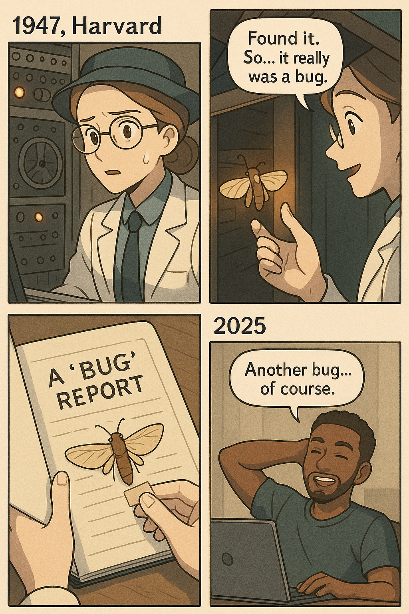

# 🏔️ Day 1: Basic Programming Magic in R

*Welcome to the Magic Forest where variables come alive and loops create endless possibilities!*

## 🔮 Learning Journey Overview

Today we'll embark on our first adventure into the magical world of R programming! By the end of today, you'll be casting spells with code and creating your very own digital art.

### 🎯 Learning Objectives
- 🔤 Write your first lines of R code
- 📝 Understand comments and why they're important
- 🎲 Master variables and data types
- 📦 Explore packages and open-source magic
- 🔄 Control program flow with if-else and loops
- 🎨 Create beautiful mosaic art with code

---

## 👋 Let's Get to Know Each Other!


#### 🎨 Two Truths and a Creative Lie
*Duration: 10 minutes*

How to Play:
1. For small groups of 4-5 people. Try to sit with people you don't know very well!

2. Each person shares 3 things about themselves:
   - ✅ Two TRUE things (real facts about you)
   - 🎭 One CREATIVE LIE (something fun and silly that you made up)

3. Examples to get you started:
   - "I have a pet turtle named Mr. Speedy"
   - "I can speak three languages"
   - "I once ate 15 pancakes in one sitting"
   - "My favorite color changes every Tuesday"

4. Guess the lie! After each person shares, everyone else tries to figure out which one is the creative lie.

5. Reveal the lie! Share which was the lie and tell the real story behind your truths.

---

## 1. 🗿 Building Our Magical World
*Duration: 35 minutes*

Before we can start our programming adventure, we need to set up our magical coding environment! Think of this like building a castle where all our R magic will live.

### 🏰 Step 1: Create Your Coding Castle
Head over to our [Posit Cloud Setup Guide](../setup/posit-cloud-setup.md) and create your castle.

💡 **Important**: Complete the Posit Cloud setup before continuing with today's activities. This is where all your magical data science adventures will start! ✨

### ☁️ Step 2: Learning more about Posit Cloud (same as R Studio interface)

*The Magic Interface*

- **📝 Editor (top left):** Your magical scroll for writing longer R spells (code).
- **🔮 Console (bottom left):** Cast spells (code) here and see the magic happen instantly!
- **🌳 Environment (top right):** All the magical creatures (variables, data) you create will live here.
- **🗺️ Files & Plots (bottom right):** Find your project files and see the beautiful plots/graphs you create.


### 🖨️ Step 3: Practice Print Statement

#### 🎈 Activity: Magical Print Adventure!

Time to practice your first spell - the `print()` command! This magical spell makes words appear on your screen.

**How to cast the spell:**
1. In the Console (bottom left), type: `print("Write down what you want to say!")`
2. Press **Enter** and watch the magic happen! ✨

Some print ideas:
- `print("My name is [YOUR NAME]")`
- `print("🦦 Oda the Data Otter says hi!")`
- `print("Fun fact: Otters hold hands when they sleep!")`
- `print("✨ I can make the computer talk to me! ✨")`
- `print("🎉 This is my first day as a data scientist! 🎉")`

**💡 Pro Tips:**
- Don't forget the quotation marks " " around your text!
- You can use emojis to make your messages more fun
- Each print statement creates a new line

**🐛 Common Mistake:** 
- Forgetting the quotation marks - R needs them to know it's text!
- Forgetting the right parenthesis - R needs () both, like minions has 2 arms, it needs 2 arms to hug your sentence!


### 📜 Step 4: Write Your First Magical scroll ✨

Ready to write your first piece of R code? We call them scripts, but think of them as magical scrolls!

1. Create Your Scroll
- In the top-menu, click **File** -> **New File** -> **R Script**.
- A blank page will appear. This is where you'll write your spell!

2. Save Your Scroll
- Click the blue save icon (💾).
- Name your file `my_first_spell.R` (or any other name you like) and click **Save**.

3. Write Your Spell
- Copy and paste the code below into your new scroll:
```R
# set variable a to have the value of 1
a <- 1

# set variable b to have the value of 2
b <- 2

# set variable c to have the value of (a + b)
c <- a + b

# print out the value of c
print(c)
```

4. Cast Your Spell!

There are a few ways to run your code:

- Run one line at a time:
  - Click on the line of code you want to run.
  - Click the **Run** button, or press `Ctrl+Enter` (Windows) or `Cmd+Enter` (Mac).
  - This is great for testing your spell line-by-line!

- Run a chunk of code:
  - Highlight the lines you want to run with your mouse.
  - Click the **Run** button at the top-right of your script editor.
  - You will see the result in the Console below.

- Run the whole script (Source):
  - Click the **Source** button to run everything in your file at once. It's like casting a big, powerful spell!
  - You should see the number `3` appear in the console. You just did magic with code!


---

## 2. 🧙‍♀️ Understanding Your First Magical Scroll

Great job creasting your first magical scroll! But what exactly happened? Let's break down the magic step by step.

### 2.1 💬 Comments: Messages to Future You

First, notice the lines that start with `#`. These are called **comments**:

```R
# set variable a to have the value of 1
```

💡 **What are comments?**
- Comments are notes you write to yourself (and others) to explain what your code does
- The computer ignores everything after the `#` symbol
- Think of them as sticky notes on your magical scrolls!

🤔 Why use comments?
- They help you remember what you were thinking
- They help others understand your magic
- They make finding and fixing mistakes easier!

🎈 Try this: 
- Add a comment to your spell that says what the final answer should be!
- Add a comment at the begining of the magical scroll to sign your name:
```R
# This magical scroll belongs to: YOUR NAME
```

### 2.2 🏷️ Variables: Magical Storage Boxes

The real magic happens with **variables**. Think of variables as magical storage boxes with labels:

```R
a <- 1    # Put the number 1 in a box labeled "a"
b <- 2    # Put the number 2 in a box labeled "b"
c <- a + b # Take what's in box "a" and "b", add them, put result in box "c"
```

The `<-` symbol is like an arrow pointing into the box. It means "store this value here."

### 2.3 🏷️ Variable Naming: Like Naming Your Pet!

In everyday life, we give names to complicated things to make talking easier. Instead of saying "that furry animal with 4 legs that barks and wags its tail," we just say "dog!" 

In R, we do the same thing with data - we give it names so we can use it easily later.

```R
result <- 3*2 + 5
result
# [1] 11
```

When R runs this code, it first calculates `3*2 + 5` (which equals 11), then stores that number in a box labeled `result`.

**💡 Variable Naming Rules:**
- Can use letters (A-Z, a-z), numbers, underscores (_), and dots (.)
- Cannot start with a number** (like `2cats` ❌)
- Cannot have spaces (use `my_cat` not `my cat` ❌)
- Case matters - `Result` and `result` are different!

**💡 Good naming style (like good pet names!):**
- Use lowercase letters: `my_age` ✅
- Use underscores for spaces: `favorite_color` ✅  
- Make names meaningful: `student_count` ✅ (not just `a`, or `b` ❌)

### 2.4 🌊 Data Types: The Four Magical Islands

Just like Oda's ocean has different islands 🏝️, R has different types of data. Here are 4 data types that Oda commonly use in her otterly beautiful data adventures :

1. **🔢 Integer Island** - Whole numbers (1, 5, 100)
2. **🧮 Numeric Island** - Decimal numbers (1.5, 3.14, 2.7)  
3. **📝 Character Island** - Words and letters ("hello", "Oda", "let's go swim!")
4. **✅ Logical Island** - True or False (TRUE, FALSE)

#### 🎈 Activity: Data Islands Adventure!

Time to explore the data islands! We'll divide the room in half and create a magical data world.

Setup:
- Half the room = Variable Boxes
  - students get empty boxes
  - ‼️ TODO: Students please write your own variable names on the box
- Half the room = Values (will get cards after forming islands)

##### Round 1: Form the Data Islands
1. Value students form four islands in 4 groups:
   - Integer Island (whole numbers)
   - Numeric Island (decimal numbers)  
   - Character Island (words)
   - Logical Island (TRUE/FALSE)
2. Instructor gives out blank value cards to each island
3. ‼️ TODO: Students please write your own values based on your island type:
   - Integer Island: whole numbers (e.g., 1, 5, 10, 25)
   - Numeric Island: decimal numbers (e.g., 1.5, 3.14, 2.7, 5.8)
   - Character Island: words (e.g., "Oda", "magic", "otter", "data")
   - Logical Island: TRUE or FALSE

##### Round 2: Variable Assignment
1. Variable students and Value students voluntarily match up (one-to-one pairs)
2. Each pair links arms and practices saying: "I am [variable name] and I store [value]!"
3. Make sure everyone has a partner before moving on!

##### Round 3: Magical Calculations
1. Instructor holds a calculation box labeled `result`
2. Simple addition: "Add up all students from Integer Island!"
3. Variable + Value pairs come together and hold hands
4. Instructor gets the final answer and becomes e.g., `result <- 41`

##### Round 4: Variable Updates
1. Update a variable: "box_1, please throw away your old value, you now store 100."
2. Repeat the calculation - different result!
3. **Important lesson:** Variables can change, calculations give new results!

##### Round 5: Order of Operations Magic
1. Big calculation: `result <- 4 + 3*4`
2. Show the steps:
   - First: `3*4` students hold hands → make 12
   - Then: `4 + 12` → make 16  
   - Finally: assign 16 to `result`
3. **Key lesson:** Multiplication happens before addition, before value assignment to variables!


### 2.5 💥 Errors

🐛 **Don't worry - Everyone makes mistakes when coding!**

R is like learning a new language! Just like human languages, R has rules. But R is different from human languages in two important ways:

1. *The rules are simple* - You can learn most of them in just a few weeks!
2. *The rules are strict* - Unlike humans who can understand you even with small mistakes, computers need you to follow the rules exactly.

Even Oda the Otter makes mistakes when casting data spells! When you forget something in your code, R will show you an error message to help you fix it.

#### 🎈 Activity: Let's try making a mistake on purpose:

In the Console, try typing this broken spell:
```R
print("My favorite number is " + 1)
```

*What happened?*
- R shows you an error message like "non-numeric argument to binary operator"
- This means you can't add text ("My favorite number is ") and numbers (1) together - they're different types!

*How to fix it:*
```R
print("My favorite number is 1")  # ✨ Now it works!
```

**💡 Common Beginner Mistakes:**
- Forgetting the closing `)` parenthesis
- Forgetting quotation marks `"`
- Mixing up different data types

**🎯 The Most Important Skill: Debugging!**
Learning to find problems, fix them, and move on is one of the MOST important skill in coding. Even your instructor makes errors every day!

This skill will make you a coding superhero! 🦸‍♀️🦸‍♂️

#### 🤡 Fun Fact: Why are errors in code called bug?
*Because it was actually a BUG...*

In 1947, computer scientist Grace Hopper found an actual moth stuck in a the powerful computer Mark II at Harvard, which caused the computer to break down! She taped it in her logbook and wrote "First actual case of bug being found." Since then, we call computer problems "bugs" and fixing them "debugging"! 🐛



---

## 3. 🪄 Making Magical Decisions: If-Else Adventures
*Duration: 25 minutes*

Welcome to the next magical part of programming - teaching your code to make decisions! Just like Oda the Otter decides whether to swim upstream or downstream based on the current, our code can make choices too! 🦦✨

### 3.1 🎈 Activity: The Magic Color Decision Game
*Duration: 10 minutes*

Before we write code, let's experience how decision-making works for humans using our voice and body!

#### How to Play:
1. Look at your shirt color
2. Follow Oda's Magic Rules:

##### Round 1: Simple If-Else
- **IF** you're wearing WHITE → "Roar like a lion!" 🦁
- **ELSE** → "Swim like an otter!" 🦦 

```R
# 🔮 Simple if-else decision
shirt_color <- "white"  # Try changing to other colors!

if (shirt_color == "white") {
  print("🦁 Roar like a lion!")
} else {
  print("🦦 Swim like an otter!")
}
```

##### Round 2: OR condition
- **IF** you're wearing WHITE **or** BLUE → "Roar like a lion!" 🦁
- **ELSE** → "Swim like an otter!" 🦦 

```R
# 🔮 OR condition decision
shirt_color <- "blue"  # Try "white", "blue", or "red"

if (shirt_color == "white" | shirt_color == "blue") {
  print("🦁 Roar like a lion!")
} else {
  print("🦦 Swim like an otter!")
}
```

##### Round 3: AND condition
- **IF** you're wearing WHITE **and** BLUE → "Roar like a lion!" 🦁
- **ELSE** → "Swim like an otter!" 🦦 

```R
# 🔮 AND condition decision (need BOTH colors)
shirt_color <- "white"
pants_color <- "blue"

if (shirt_color == "white" & pants_color == "blue") {
  print("🦁 Roar like a lion!")
} else {
  print("🦦 Swim like an otter!")
}
```

##### Round 4: If-ElseIf-Else
- **IF** you're wearing BLACK → "Bark like a dog!" 🐶
- **ELSE IF** you're wearing BLUE → "Hop like a bunny!" 🐰
- **ELSE** → "Moo like a cow!" 🐮

```R
# 🔮 Multiple condition decision
shirt_color <- "black"  # Try "black", "blue", or "red"

if (shirt_color == "black") {
  print("🐶 Bark like a dog!")
} else if (shirt_color == "blue") {
  print("🐰 Hop like a bunny!")
} else {
  print("🐮 Moo like a cow!")
}
```

##### Round 5: No Else (Some people might not do anything!)
- **IF** you're wearing BLACK → "Bark like a dog!" 🐶
- **ELSE IF** you're wearing BLUE → "Hop like a bunny!" 🐰

```R
# 🔮 No "else" - some conditions don't trigger any action
shirt_color <- "red"  # Try "black", "blue", or "red"

if (shirt_color == "black") {
  print("🐶 Bark like a dog!")
} else if (shirt_color == "blue") {
  print("🐰 Hop like a bunny!")
}
# Notice: No "else" - if wearing red, nothing happens!
```

##### Round 6: Multiple actions
- **IF** you're wearing BLACK → Stand up → "Bark like a dog!" 🐶
- **ELSE IF** you're wearing BLUE → Hands in the air → "Hop like a bunny!" 🐰
- **ELSE** → cover your eyes → "Moo like a cow!" 🐮

```R
# 🔮 Multiple actions in each condition
shirt_color <- "black"  # Try different colors

if (shirt_color == "black") {
  print("🧍 First, I stand up!")
  print("🐶 Then I bark like a dog!")
} else if (shirt_color == "blue") {
  print("🙌 First, hands in the air!")
  print("🐰 Then hop like a bunny!")
} else {
  print("🙈 First, I cover my eyes!")
  print("🐮 Then moo like a cow!")
}
```

#### 💡 **What Did We Learn?**
- Decisions follow a pattern: Check a condition → Do 1 or more action(s)
- We can combine conditions with **OR** (`|`) and **AND** (`&`)
- We can have multiple conditions with **"else if"**
- We can have a backup plan with **"else"** - but it's optional!
- We can do multiple actions inside each condition
- Only ONE path gets chosen - just like only one group of people did each action!

### 3.2 🖥️ Coding Magic: Teaching R to Make Decisions

Now let's teach R the same decision-making magic! In your R script, try these spells:

#### ✨ Spell 1: Simple If-Else Magic
```R
# 🔮 Oda's first decision spell
my_favorite_number <- 7

if (my_favorite_number > 5) {
  print("🎉 Wow! That's a big number!")
} else {
  print("💭 That's a nice small number!")
}
```

#### 🎈 Activity: Try It Yourself!
1. Change `my_favorite_number` to different values (try 3, 10, 1)
2. Run the code each time - what happens?
3. **Challenge:** Can you predict the message before running it?

#### ✨ Spell 2: Multiple Choices (If-ElseIf-Else)
```R
# 🌈 Oda's color mood detector
favorite_color <- "blue"

if (favorite_color == "red") {
  print("🔥 You like bold and exciting adventures!")
} else if (favorite_color == "blue") {
  print("🌊 You love calm and peaceful vibes!")
} else if (favorite_color == "green") {
  print("🌱 You enjoy nature and growing things!")
} else {
  print("✨ You have a unique and magical taste!")
}
```

#### 🎈 Activity: Customize Your Color Magic!
1. Change `favorite_color` to your actual favorite color
2. If your color isn't there, what message do you get?
3. **Extension:** Add your favorite color with a special message!

#### ✨ Spell 3: Number Range Detective
```R
# 🔍 Oda's number detective game
mystery_number <- 15

if (mystery_number < 10) {
  print("🐣 Tiny number - like a baby otter!")
} else if (mystery_number < 50) {
  print("🦦 Medium number - like a young otter!")
} else if (mystery_number < 100) {
  print("🏔️ Big number - like a mountain otter!")
} else {
  print("🚀 Huge number - like a space otter!")
}
```

### 3.3 🧠 Understanding Decision Logic

#### The Magical Comparison Symbols:
- `==` means "is exactly equal to" (like twin otters! 🦦 == 🦦)
- `>` means "is greater than" (elephant is larger than otter 🐘 > 🦦)
- `<` means "is less than" (mouse is smaller than otter! 🐭 < 🦦)
- `>=` means "greater than or equal to" 
- `<=` means "less than or equal to"
- `!=` means "is NOT equal to" (otters are different from birds! 🦦 != 🐧)

#### 💡 Important Rules:
1. **Use `==` for comparison, not `=`** 
   - `=` assigns a value (like `<-`)
   - `==` checks if two things are the same
2. **Conditions go in parentheses:** `if (condition)`
3. **Actions go in curly braces:** `{ action }`
4. **Only ONE path gets chosen** - just like our physical game!

### 3.4 🎮 Challenge: Build Your Own Decision Tree!

Create a magical creature classifier! Copy this code and fill in the blanks:

```R
# 🦄 Magical Creature Classifier
creature_size <- "medium"  # Try: "tiny", "medium", "huge"
creature_color <- "purple" # Try: "purple", "gold", "rainbow"

if (creature_size == "tiny") {
  if (creature_color == "purple") {
    print("🧚‍♀️ You found a tiny fairy!")
  } else {
    print("🐛 You found a magical bug!")
  }
} else if (creature_size == "medium") {
  if (creature_color == "purple") {
    print("🦄 You found a unicorn!")
  } else if (creature_color == "gold") {
    print("🐉 You found a baby dragon!")
  } else {
    print("🦦 You found Oda the Otter!")
  }
} else {
  print("👹 You found a friendly giant!")
}
```

**🎯 Your Mission:**
1. Try different combinations of `creature_size` and `creature_color`
2. Add a new size option ("enormous") with your own magical creature
3. Add a new color option with your own special message

### 3.5 🐛 Common Mistakes & How to Fix Them

**Mistake 1:** Using `=` instead of `==`
```R
# ❌ Wrong - this assigns a value
if (x = 5) { ... }

# ✅ Correct - this compares values  
if (x == 5) { ... }
```

**Mistake 2:** Forgetting curly braces
```R
# ❌ Hard to read
if (x > 5) print("big")

# ✅ Clear and safe
if (x > 5) {
  print("big")
}
```

**Mistake 3:** Missing parentheses
```R
# ❌ R gets confused
if x > 5 { ... }

# ✅ R understands perfectly
if (x > 5) { ... }
```

**💡 Pro Tips:**
- Test your conditions with simple values first
- Use meaningful variable names: `student_age` not just `x`
- **Every `if` should have an `else`** - always have a backup plan!
- When in doubt, add more parentheses and braces

🎉 **Congratulations!** You've learned how to make your code think and decide! This is one of the most powerful tools in programming - you can now create interactive programs that respond differently based on input!

---

## 5. ✨ Magical Tips & Tricks

- 💡 **Save your work often!** Click the save icon or press `Ctrl+S` (Windows) / `Cmd+S` (Mac).
- 🐛 Errors are okay! They are just clues to help you learn and fix your spell.
- 🌈 Make your code colorful! Rainbow parentheses help you see where code blocks start and end. Here's how to turn them on:
  1. Go to **Tools** -> **Global Options**.
  2. Click **Code** on the left.
  3. Go to the **Display** tab on the top.
  4. Check the box for **Use rainbow parentheses**.
  5. Click **Apply**!
- 📝 Name things like a wizard! Good names help you remember what your magical creatures (variables) do:
  - Use `snake_case` or `kabab-case` (like `my_age` or `favorite-color`)
  - Always start with a letter, never a number (✅ `age1` ❌ `1age`)
  - Only use lowercase letters, numbers, and `-` or `_`
  - Make names short but meaningful (this is hard but important!)

## 6. 🆘 Troubleshooting

#### "object 'my_variable' not found"
- What it means: You tried to use a magical creature (variable) that R doesn't know about.
- Why it happens:
  - You forgot to create your variable first (like `my_variable <- 10`)
  - You have a typo in the name
- The Fix: Run the line that creates your variable first, then check your spelling!

#### Case-Sensitivity Chaos
- What it means: R thinks `MyData` and `mydata` are totally different things.
- Why it happens: R is picky about capital letters.
- The Fix: Always spell your variables exactly the same way - capitals matter!

#### Missing Parentheses or Quotes: ( or "
- What it means: You opened something but forgot to close it.
- Why it happens: Easy to forget!
- The Fix: Count your `(` and `)`, and your `"` marks. The rainbow parentheses we turned on help you see which ones match!

---


## DELETE below
## 📚 Today's Magical Concepts

### 🌅 1.5 hours

#### 1. 🎯 What is Data Science?
*Discover how data science helps us understand the world around us*

#### 2. 🖥️ First Lines of Code
*Write your magical "Hello World!" and see R come alive*

#### 3. 📝 Comments: Leaving Notes for Future You
*Learn why commenting is like leaving breadcrumbs in the forest*

#### 4. 🎲 Variables: Magic Containers
*Store numbers, words, and lists in R's magical containers*

#### 5. 🏷️ Data Types Island
*Explore the different types of data R can understand*

### 🌞 1.5 hours

#### 6. 📦 Packages: Community Magic
*Discover the power of open-source collaboration*

#### 7. 🔀 If-Else: Making Decisions
*Teach your code to make choices*

#### 8. 🔄 For Loops: Repetition Magic
*Make R repeat tasks efficiently*

#### 9. 🎮 Class Challenge: Word Reorganizer
*Team up to create and solve word puzzles*

#### 10. 🎨 Individual Project: Mosaic Art
*Create beautiful art using programming*

## 🎪 Activities & Challenges

### 🏝️ Activity 1: Data Type Island
*Duration: 20 minutes*

Explore an imaginary island where different data types live in different regions. You'll categorize R objects and learn how R "thinks" about different kinds of information.

**What you'll learn:**
- Numbers (integers and decimals)
- Text (characters and strings)
- True/False values (logical)
- Lists and vectors

**Files:** `activities/data-type-island.R`

### 🔄 Activity 2: Loop Adventures
*Duration: 25 minutes*

Practice writing for loops through three magical examples that demonstrate the power of repetition in programming.

**What you'll learn:**
- Basic for loop syntax
- Using print() statements
- Debugging incomplete code
- Problem-solving strategies

**Files:** `activities/loop-adventures.R`

### 🎯 Class Challenge: Magic Forest Word Reorganizer
*Duration: 30 minutes*

**Part 1:** Given a magical story sentence, use a for loop to reorganize the words and create a word list.

**Part 2:** Challenge a classmate to write code that restores your scrambled words back into the original story!

**Example Story:**
*"In the Magic Forest, a smart rabbit and a tiny dragon became friends, built a flying boat out of leaves, and sailed through the sky to save a sleepy bear cub who was stuck on a candy cloud."*

**Files:** `activities/magic-forest-challenge.R`

### 🎨 Individual Project: Mosaic Art Creator
*Duration: 45 minutes*

Create stunning digital mosaic art using R programming! You'll use loops, variables, and creativity to generate colorful patterns.

**What you'll create:**
- Geometric patterns
- Color gradients
- Repeating designs
- Your own artistic vision

**Files:** `activities/mosaic-art-project.R`

## 📊 Sample Code Preview

Here's a sneak peek at some magic you'll learn today:

```r
# 🔮 Creating magical variables
wizard_name <- "Hermione"
spell_power <- 95
is_magical <- TRUE

# 🌟 A simple for loop
for (i in 1:5) {
  print(paste("Casting spell number", i))
}

# 🎨 The beginning of art creation
colors <- c("red", "blue", "green", "purple")
plot(1:10, 1:10, col = colors, pch = 19, cex = 3)
```

---

*Remember: Every expert programmer started exactly where you are today. Have fun, be curious, and don't be afraid to make mistakes - that's how we learn!* ✨