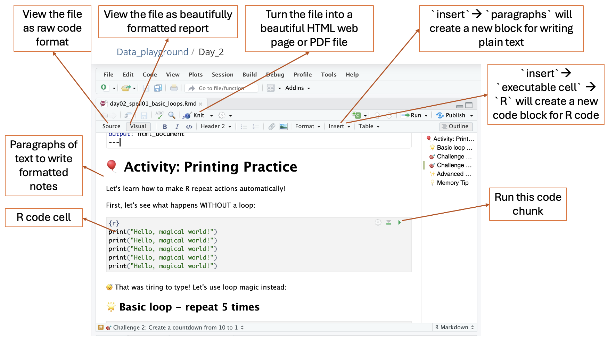

# 🪄 Day 2: Loops and Magic Libraries

*Oda the Data Otter learns to repeat magic spells and discovers R's treasure box of helpful tools!*

```{image} ../../images/loop.png
:alt: loop
:width: 50%
```

## 🎯 Learning Objectives
- 🔄 Master for loops to repeat magical actions automatically
- 📚 Discover what open-source means and how packages work
- 🆘 Learn how to get help using the `?` function
- 🎨 Create your first simple visualizations with ggplot2
- 🗂️ Understand what dataframes are with simple examples


## 1. Ice Breaker: Human Decision Tree Builder
*Duration: 15 minutes*

🎈 **Activity:** Work in groups of 3-4 to interview each other, draw a decision tree, and write if-else code that sorts each group member into a unique category! This refreshes Day 1's if-else magic while preparing us for data exploration.


**How to Play:**
1. Discovery Questions *(4 min)*: Share with your group:
   - What do you have in common with some (but not all) group members?
   - What makes you different from everyone else in your group?
   
   Example discoveries:
   - "Sarah loves math, but Sky and Jamie prefer art"
   - "Only Sky has a pet, the rest of us don't have any"
   - "Sky and Sarah are 12+, but Jamie is 11"

2. Find Your Split Points *(5 min)*:
   - What question divides your group into 2 roughly equal parts?
   - Within each part, what question separates people further?
   - Can you create a path where everyone ends up alone?

3. Draw & Code *(5 min)*:
   
**Simple Example Decision Tree:**
```
                    Age >= 12?
                   /          \
                YES            NO
               /                \
        Love math?           Jamie (11)
       /        \            "Young Explorer"
     YES        NO
    /            \
Sarah (12)    Sky (28)
"Math Wizard"  "Pet Lover"
```

**Corresponding R Code:**
```R
# Test with each person's info!
name <- "Sarah"     # Try "Sarah", "Sky", "Jamie"
age <- 12           # Sarah: 12, Sky: 13, Jamie: 11  
loves_math <- TRUE  # Sarah: TRUE, Sky: FALSE, Jamie: FALSE
has_pet <- FALSE    # Sarah: FALSE, Sky: TRUE, Jamie: FALSE

if (age >= 12) {
  if (loves_math == TRUE) {
    print("Sarah: 🧮 Math Wizard!")      # Sarah lands here
  } else {
    print("Sky: 🐈 Pet Lover!")        # Sky lands here  
  }
} else {
  print("Jamie: 🌟 Young Explorer!")     # Jamie lands here
}
```

4. **Reflect (1 min):** 
   - Does everyone get their own category? 
   - What surprised you about your group's similarities and differences?


## 2. Magic Loops: Making R Repeat Spells
*Duration: 85 minutes*

🎭 **Imagine you're a chef baking 10 cookies.** Instead of repeat the actions, "mix flour, add sugar, bake", 10 separate times, you create a robot and repeat this procedure for you 10 times! That's exactly what for loops do - they let us repeat code without typing it over and over.

🔮 **The Magic Formula:** `for (number in 1:10) { # do something }`
- `number` is like a counter that changes each time (number = 1, then 2, then 3...)
- `1:10` means "count from 1 to 10"
- Everything inside `{}` get executed 10 times!

```R
for (number in 1:10){
    print(paste("🍪 Making Cookie #", number))
    print("🥛 Mix flour")
    print("🍯 Add sugar")
    print("🔥 Bake")
    print("") # add an empty line before we start making the next cookie!
}
```


### 2.1 Spell 1: Basic Loop Magic
*Duration: 15 minutes*

📁 **Find this spell in [Posit Cloud](https://posit.cloud):** Look for the file `day02_spell01_basic_loops.Rmd` in your project files!

#### 2.1.1 🔮 R Markdown Files (.Rmd)

🎉 **Big upgrade!** Yesterday we used `.R` files, but today we're using `.Rmd` files - they're like super-powered R files!

##### 💡 What is an R Markdown (.Rmd) file?
- **Think of it like a magic notebook** where you can mix your hand-written notes with code!
- **Day 1:** We used `.R` files - just plain code
- **Day 2+:** We use `.Rmd` files - code + beautiful formatting + notes all in one!



##### 🎯 Key Parts of .Rmd Files:

**1. Text/Paragraphs** 📝
- Click `insert` --> `paragraph` to add a new paragraph block
- Just type normally like this sentence
- Use `#` for big titles, `##` for smaller titles
- Use `**bold**` or `*italic*` for emphasis

**2. Code Chunks** 💻
- Click `insert` --> `Executable Cell` --> `R` to add a new paragraph block
- Code lives inside special "fences" that look like this:
````
```{r}
print("This is R code!")
```
````
- Click the ▶️ green arrow to run just that chunk
- You can run one piece at a time instead of the whole file!

**3. Two Ways to View Your File:**
- **📝 `Source` Mode:** See the raw code and text (like peeking behind the magic curtain)
- **👁️ `Visual` Mode:** See it formatted nicely (like the final magic show)
- Click the buttons at the top left to switch between them!

**4. The `Knit` Button** 🧶
- Turns your .Rmd file into a beautiful HTML webpage or PDF file
- Like magic - combines all your code, results, and explanation notes into one pretty document
- Try it later to see your work as a professional report!

Let's use `.Rmd` files to learn how to make R repeat actions automatically! We'll start by printing messages and watching our counter change.


#### 🎈 Activity: Printing Practice

```R
# Without a loop (tiring!)
print("Hello, magical world!")
print("Hello, magical world!")
print("Hello, magical world!")
print("Hello, magical world!")
print("Hello, magical world!")
```

```R
# 🌟 Basic loop - repeat 5 times
for (i in 1:5) {
  print("Hello, magical world!")
}
```

```R
# 🎯 Challenge 1: Print your name 3 times using a for loop
# Fill in the blanks, replace the ... with the correct number or string
for (i in 1:...) {
  print("My name is ...")
}
```

```R
# See what 'i' actually does
for (i in 1:5) {
  print(paste("This is loop number", i))
}
```

```R
# 🎯 Challenge 2: Create a countdown from 10 to 1
# Hint: Use 10:1 instead of 1:10
# Note: paste() glues strings together
for (countdown in ...:...) {
  print(paste("Countdown:", countdown))
}
print("🚀 Blast off!")
```

```R
# ✨ Advanced Challenge: Print different animals on each loop
# Note: c() creates a collection of items
animals <- c("🐶 dog", "🐱 cat", "🐰 rabbit", "🐸 frog", "🦆 duck")

for (i in 1:5) {
  print(paste("Animal", i, "is a", animals[i]))
}
```

💡 **Pro Tips from this spell:**
- Think of `i` as a magical counter that changes each time!
- The loop runs once for each number in the range you give it
- Use `c()` to create collections of items like animals or names
- `paste()` is great for gluing strings and numbers together

### 2.2 🏃‍♀️ Physical Activity: Human For Loop Theater
*Duration: 30 minutes*

🎭 **Now that you understand loops, let's BE the loops!** Time to get creative and invent your own human loop performance!


#### 🎈 Activity: Design Your Own Loop Performance

**🌟 Your Mission:** Work in groups of 5-6 to create and perform an original human for loop! You can use the examples below for inspiration, but we want to see YOUR creative ideas!

**🎪 Example Inspiration (but make it your own!):**

**🍪 Example #1: Cookie Factory Assembly Line**
- Setup: 3 people are stations, 2 person is the "cookie dough," 1 person is the loop counter
- Loop Counter says: "Starting iteration 1!"
- Station 1: "Mixing flour!" (stirring motion)
- Station 2: "Adding sugar!" (sprinkling motion)  
- Station 3: "Baking cookie!" (oven motion)
- Cookie dough 1 walks through all 4 stations, then goes to back of line --> cookie 1 ready!
- Loop Counter says: "Starting iteration 2!" and repeat --> Cookie dough 2 ready!
- After 2 cookies: Everyone shouts "Cookie factory loop complete!"

**🐰 Example #2: Human Computer Instructions**
- Setup: 1 person is the "code," 4-5 people are individual "computer action actors"
- Code calls out: "For i in 1 to 3, execute these actions in sequence:"
- Code calls out: "Iteration 1! Sarah - jump like a rabbit! Tom - spin around! Lisa - clap 2 times! Mike - roar like a lion!"
- Each actor performs their specific action when called: Sarah hops, Tom spins, Lisa claps, Mike roars
- Code calls out: "Iteration 2! Sarah - jump like a rabbit! Tom - spin around! Lisa - clap 2 times! Mike - roar like a lion!"
- Same actors repeat their same actions in the same order
- Code calls out: "Iteration 3! Sarah - jump like a rabbit! Tom - spin around! Lisa - clap 2 times! Mike - roar like a lion!"
- After iteration 3: Code says "Loop complete!" and all actors freeze

**🎨 Creative Ideas to Spark Your Imagination:**
- Sports training routines (jumping jacks, running laps, passing balls)
- Morning routines (brush teeth, eat breakfast, get dressed)
- Art creation (draw, color, cut, paste)
- Music performances (clap, stomp, sing, repeat)

**⏰ Timeline:**
- **Planning & Practice (20 minutes):** Brainstorm your loop idea, assign roles, and rehearse
- **Performances (10 minutes):** Each group performs for 1-2 minutes

**🎉 Performance Guidelines:**
- Start by announcing: "Our loop is in iteration X!"
- End with: "Loop complete!" or something creative


### 2.3 Spell 2: Loop Detective Challenge
*Duration: 15 minutes*

📁 **Find this spell in Posit Cloud:** Look for the file `day02_spell02_loop_debugging.Rmd` in your project files!

#### 🎈 Activity: Fix the Broken Code

🕵️ **Detective Mission:** Someone cast incomplete loop spells! Your job is to debug the broken code and fill in the blanks to make loops work perfectly. Follow the clues and fix the missing pieces!

```R
# 🐛 Broken Spell #1: Missing loop variable
# Goal: print numbers 1 through 7
for ( in 1:7) {
  print(paste("Number:", i))
}
```

```R
# 🐛 Broken Spell #2: Missing closing brace
# Goal: print "Magic spell" 4 times
for (spell in 1:4) {
  print("Magic spell")

```

```R
# 🐛 Broken Spell #3: Wrong range
# Goal: count from 1 to 10
for (num in 1:) {
  print(paste("Counting:", num))
}
```

```R
# 🐛 Broken Spell #4: Missing quotes
# Goal: print a message with each student's name
students <- c("Alex", "Sam", "Jordan", "Taylor")
for (student in students) {
  print(paste(Hello, student))
}
```

```R
# 🐛 Broken Spell #5: Incomplete calculation
# Goal: print the square of each number
for (number in 1:5) {
  square <- number * 
  print(paste(number, "squared is", square))
}
```

```R
# ✨ Advanced Detective Challenge:
# Target pattern: ⭐, ⭐⭐, ⭐⭐⭐, ⭐⭐⭐⭐
for (i in 1:4) {
  stars <- 
  for (j in 1:) {
    stars <- paste(stars, "⭐", sep="")
  }
  print(stars)
}
```

### 2.4 Spell 3: Art with Loops
*Duration: 20 minutes*

📁 **Find this spell in Posit Cloud:** Look for the file `day02_spell03_art_with_loops.Rmd` in your project files!

#### 🎈 Activity: Creative Programming Patterns

✨ **Challenge:** Create beautiful art using loops and programming patterns - from simple stars to colorful grids and even Christmas trees!

```R
# 🎨 Art Example 1: Simple patterns with basic symbols
print("--- Simple Hash Pattern ---")
for (row in 1:5) {
  pattern <- ""
  for (col in 1:row) {
    pattern <- paste(pattern, "#", sep="")
  }
  print(pattern)
}
```

```R
# 🐟 Fish Pattern Example: Create a fish shape using # symbols
print("\n--- Fish Pattern ---")
fish_pattern <- c(
  "    ##",
  "   ##@#",
  "  ######",
  " #------#",
  "##########",
  " ########",
  "  ######",
  "   ####",
  "    ##",
  "   ####",
  "  ######"
)

for (line in fish_pattern) {
  print(line)
}
```

```R
# 🎨 Art Example 2: Emoji patterns
print("\n--- Simple Star Pattern ---")
for (row in 1:5) {
  stars <- ""
  for (col in 1:row) {
    stars <- paste(stars, "⭐", sep="")
  }
  print(stars)
}
```

```R
# 🎨 Art Example 3: Colorful symbol patterns
print("\n--- Rainbow Pattern ---")
symbols <- c("🔴", "🟠", "🟡", "🟢", "🔵", "🟣")

for (row in 1:6) {
  line <- ""
  for (col in 1:row) {
    symbol_index <- col %% 6 + 1
    line <- paste(line, symbols[symbol_index], sep="")
  }
  print(line)
}
```

```R
# 🎨 Art Example 4: Grid patterns
print("\n--- Grid Art ---")
symbols <- c("⭐", "🌙", "☀️", "💫")

for (row in 1:4) {
  line <- ""
  for (col in 1:6) {
    symbol_index <- (row + col) %% 4 + 1
    line <- paste(line, symbols[symbol_index], sep="")
  }
  print(line)
}
```

```R
# 🎨 Art Example 5: Christmas tree pattern
print("\n--- Christmas Tree Pattern ---")
for (row in 1:5) {
  # Add spaces for centering
  spaces <- ""
  for (space in 1:(5-row)) {
    spaces <- paste(spaces, " ", sep="")
  }
  
  # Add stars for the tree
  stars <- ""
  for (star in 1:(2*row-1)) {
    stars <- paste(stars, "🎄", sep="")
  }
  
  # Print the complete line
  print(paste(spaces, stars, sep=""))
}

# Add the tree trunk
print("    🪵")
```

```R
# 🎨 Art Example 6: Number triangle
print("\n--- Number Triangle ---")
for (row in 1:5) {
  line <- ""
  for (col in 1:row) {
    if (col == 1) {
      line <- paste(line, col, sep="")
    } else {
      line <- paste(line, col, sep=" ")
    }
  }
  print(line)
}
```

```R
# ✨ YOUR TURN: Create your own artistic pattern
print("\n--- Your Creative Pattern ---")
# for (row in 1:...) {
#   ...
# }
```

### 2.5 🤯 Challenging Magic -- Spell 4: Story Scrambler Challenge (Optional)
*Duration: 20 minutes (excluded from time in chapter 2)*

📁 **Find this spell in Posit Cloud:** Look for the file `day02_spell04_story_scrambler.Rmd` in your project files!

📚 **The Magic Story:** *"In the Magic Forest, a smart rabbit and a tiny dragon became friends, built a flying boat out of leaves, and sailed through the sky to save a sleepy bear cub who was stuck on a candy cloud."*

```{image} ../../images/forest.png
:alt: forest
:width: 100%
```

#### 🎈 Activity: Secret Message Encoder & Decoder

🕵️ **Turn yourself into a data spy!** Learn two secret encoding methods:
- **Method 1:** Reverse word order (like reading backwards to confuse enemies!)
- **Method 2:** Every-other-word scramble (mix odd and even positioned words!)

Create secret codes to share with friends using mini messages like "Meet me at the playground after school" or "The password is rainbow unicorn."

```R
# 📚 The Magic Story to scramble
original_story <- "In the Magic Forest, a smart rabbit and a tiny dragon became friends, built a flying boat out of leaves, and sailed through the sky to save a sleepy bear cub who was stuck on a candy cloud."

# Split the story into individual words
# Note: unlist(strsplit()) splits a string into a list of words
story_words <- unlist(strsplit(original_story, " "))
print("🔤 Original story words:")
print(story_words)
print(paste("📊 Total words:", length(story_words)))
```

```R
# 🎯 Challenge 1: Reverse Word Order Spy Code
print("\n🚀 === CHALLENGE 1: REVERSE SPY CODE ===")

# Step 1: Create reversed word list
reversed_words <- c()
for (i in length(story_words):1) {
  reversed_words <- c(reversed_words, story_words[i])
}

# Step 2: Print the reversed story
print("🔒 ENCODED (Backwards):")
reversed_story <- paste(reversed_words, collapse = " ")
print(...)  # TODO: what should we print?

# Step 3: Restore original order
original_words <- c()
for (i in length(reversed_words):1) {
  original_words <- c(original_words, reversed_words[...])  # TODO: fill in
}
print("\n🔓 DECODED (Original Order):")
original_restored <- paste(original_words, collapse = " ")
print(...)  # TODO: what should we print?
```

```R
# 🎯 Challenge 2: Every-Other-Word Spy Code
print("\n🚀 === CHALLENGE 2: EVERY-OTHER-WORD SPY CODE ===")

# Step 1: Create empty lists for odd and even positioned words
odd_words <- c()
even_words <- c()

# Step 2: Separate words by position (odd vs even)
for (i in 1:length(story_words)) {
  # Note: %% is the remainder operator (great for odd/even)
  if (i %% 2 == 1) {  # Odd positions (1, 3, 5, ...)
    odd_words <- c(odd_words, story_words[...])  # TODO
  } else {            # Even positions (2, 4, 6, ...)
    even_words <- c(even_words, story_words[...]) # TODO
  }
}

# Step 3: Create encoded message (odds + separator + evens)
encoded_words <- c(odd_words, "---", even_words)
print("🔒 ENCODED (Every-other-word):")
encoded_story <- paste(encoded_words, collapse = " ")
print(encoded_story)

# Step 4: Decode back to original (combine odd and even in correct order)
decoded_words <- c()
for (i in 1:max(length(odd_words), length(even_words))) {
  if (i <= length(odd_words)) {
    decoded_words <- c(decoded_words, odd_words[...])  # TODO
  }
  if (i <= length(even_words)) {
    decoded_words <- c(decoded_words, even_words[...]) # TODO
  }
}

print("🔓 DECODED (Original Order):")
decoded_story <- paste(decoded_words, collapse = " ")
print(...)  # TODO
```

```R
# 🎮 Bonus: Try Your Own Secret Messages!
print("\n🎮 === BONUS: YOUR SECRET MESSAGES ===")

# Try these mini stories or create your own!
mini_secret1 <- "Meet me at the playground after school."
mini_secret2 <- "I found the hidden treasure map."
mini_secret3 <- "The password is rainbow unicorn."

# Your turn: Pick one of the mini secrets and encode it!
my_secret <- "..."  # Choose one of the mini_secret messages above

# Split your secret into words
my_words <- unlist(strsplit(my_secret, " "))

# Encode using Method 1 (Reverse) or Method 2 (Every-other-word)
# Write your encoding code here:
```

💡 **Pro Tips from this spell:**
- `length()` tells you how many items are in a list
- `%%` finds remainders (great for finding odd/even numbers!)
- `paste(words, collapse = " ")` joins words back into sentences
- Use `i:1` for backwards loops, `1:i` for forward loops
- `c()` creates or adds to lists: `new_list <- c(old_list, new_item)`

## 3. Magic Libraries: R's Treasure Chest of Tools
*Duration: 30 minutes*

### 3.1 What is Open-Source Magic?
*Duration: 5 minutes*

#### 🎈 Activity: Understanding the Open-source Wizard Community (Programmer Community)

🧙‍♀️ **What is Open-Source?** Imagine a giant magical library where thousands of friendly wizards from all over the world share their best spells for FREE! Anyone can use them, improve them, and share them back to help other wizards.

🎪 **Think of it like this:**
- 📚 **Giant Free Library:** Thousands of friendly wizard-programmers create useful magical tools and share them for free
- 🤝 **Wizard Community Help:** When you have problems, other wizards help you solve them
- 🎁 **Always Free:** You never have to pay to use these amazing magical tools!
- 🌍 **Getting Better Together:** When one wizard improves a spell, everyone benefits!

💡 **Examples you know:** Google, free games - many of the tools you use every day are built with open-source magic!

### 3.2 Spell 5: Getting Help with the Magic `?` and `??`
*Duration: 5 minutes*

In R, when you don't know how something works, just type `?` or `??` for help!


📁 **Find this spell in Posit Cloud:** Look for the file `day02_spell05_getting_help.Rmd` in your project files!

#### 🎈 Activity: The Help Symbol

🆘 **Two Types of Magic Help:**

**The Magic Question Mark `?`:** When you know the exact function name, use `?`
```R
# Want to know how print() works?
?print

# Curious about the mean() function?
?mean
```

**The Super Search `??`:** When you don't know exact names but want to explore a topic, use `??`
```R
# Find ALL functions related to plotting
??plotting

# Search for anything about statistics  
??statistics
```

💡 **Think of it like this:**
- `?` = Ask about one specific spell (like "How does the fireball spell work?")
- `??` = Ask to see all spells of a type (like "Show me all fire spells!")

### 3.3 Spell 6: Your First Package - ggplot2
*Duration: 10 minutes*

📁 **Find this spell in Posit Cloud:** Look for the file `day02_spell06_first_package.Rmd` in your project files!

#### 🎈 Activity: Installing Your First Magic Tool

📦 **What is a Package?** Think of packages like apps on your parent's phone - each one adds new powers to R!

🧙‍♀️ **Remember Open-Source?** Packages are the perfect example of what we just learned! Remember how open-source is like a giant magical library where friendly wizards share their best spells? Well, packages ARE those shared spells! Someone created ggplot2 and shared it with the whole world for free, so you can make beautiful charts without having to figure out all the complicated math & code yourself!

🎭 **What is Abstraction?** This is a fancy word for "hiding the hard stuff so you can focus on the fun stuff!" Think of it like this:
- When you ride a bike, you don't need to understand how the gears work inside - you just pedal!
- When you use a microwave, you don't need to know about radio waves - you just press buttons!
- When you use ggplot2, you don't need to know the complicated math & code for drawing - you just tell it what you want!

That's abstraction - the package does all the hard work behind the scenes, so you can focus on creating amazing things! 🎪

```R
# Step 1: Install the package (like downloading an app)
install.packages("ggplot2")

# Step 2: Load the package (like opening the app)
library(ggplot2)
```

🎨 **Meet ggplot2:** This package is like a magical paintbrush that helps us create beautiful pictures with data! And the best part? Someone made this incredible tool and shared it with everyone for FREE!

💡 **Pro Tips**
- Packages are like apps that add new powers to R
- `install.packages()` downloads them once (like downloading an app)
- `library()` opens them each time you want to use them (like opening the app)


### 3.4 Spell 7: Your First Plot (No Data Yet!)
*Duration: 10 minutes*

📁 **Find this spell in Posit Cloud:** Look for the file `day02_spell07_first_plot.Rmd` in your project files!

#### 🎈 Activity: Drawing Without Data

🎭 **Let's start simple:** We can make plots even without complicated data! We'll use simple lists of information.

```R
# Load our magical plotting package
library(ggplot2)
```

```R
# Simple lists (these are called vectors)
animals <- c("pikachu", "dog", "rabbit", "hamster", "fish")
counts <- c(3, 5, 2, 1, 4)

# Your first ggplot2 magic spell!
ggplot() + 
  geom_col(aes(x = animals, y = counts))
```


🔮 **What does this code do?**
- `c()` creates a simple list
- `ggplot()` starts the magic
- `geom_col()` creates bars
- `aes()` tells R what goes where (x and y axes)

✨ **Challenge:** Try changing the animals or numbers and see what happens!

```R
# Create simple lists
animals <- c("cat", "dog", "rabbit", "hamster", "fish")
counts <- c(3, 5, 2, 1, 4)

print("🐾 Our animal data:")
print(paste("Animals:", paste(animals, collapse = ", ")))
print(paste("Counts:", paste(counts, collapse = ", ")))

# Make your first plot!
plot1 <- ggplot() + 
  geom_col(aes(x = animals, y = counts))

print(plot1)
```

```R
# 🎯 Challenge 2: Try your own food ratings data
print("\n🍕 Creating a plot with your own food ratings data!")

# Create your own lists - change these ... to your favorites!
my_foods <- c(...)
my_ratings <- c(...)

# Make a plot with your data
plot2 <- ggplot() + 
  geom_col(aes(x = my_foods, y = my_ratings))

print(plot2)
```

```R
# ✨ Challenge: Create your own plot!
# Fill in your own data and create a plot:
# (Run this after replacing the blanks)
my_categories <- c("___", "___", "___")  # Fill in 3 things you want to compare
my_values <- c(___, ___, ___)               # Fill in numbers for each thing

# Fill in the code below in ... and run them:
my_plot <- ... + 
   geom_col(aes(x = ..., y = ...))
print(...)
```

## 4. Introducing Dataframes: R's Magic Tables
*Duration: 20 minutes*

### 4.1 Spell 8: What is a Dataframe?
*Duration: 20 minutes*

🗂️ **What is a Dataframe?** Think of it like a super simple spreadsheet - it has rows and columns, just like a table you might make for organizing your Pokemon cards or book collection!

📁 **Find this spell in Posit Cloud:** Look for the file `day02_spell08_dataframes.Rmd` in your project files!

#### 🎈 Activity: Building Your First Data Table

```R
# Let's create a simple dataframe about pets
pets <- data.frame(
  name = c("Fluffy", "Buddy", "Whiskers"),
  type = c("cat", "dog", "cat"),
  age = c(3, 5, 2)
)

# Look at our dataframe
print(pets)
```

🔮 **What you'll see:**
```
     name type age
1  Fluffy  cat   3
2   Buddy  dog   5
3 Whiskers  cat   2
```

💡 **Understanding the parts:**
- **Columns:** `name`, `type`, `age` (like categories)
- **Rows:** Each pet gets one row (like one card in your collection)
- **data.frame():** The magic function that creates tables

✨ **Challenge:** Create your own dataframe about your favorite foods, movies, or friends!


```R
# 🎯 Challenge 2: Create your own dataframe
print("\n👫 Creating a dataframe about your friends!")

# Make a dataframe about your friends (change the data to match your real friends!)
friends <- data.frame(
  name = c("Sky", "...", "..."),
  favorite_color = c("...", "...", "gre...en"),
  age = c(28, ..., ...)
)

print(friends)
```

```R
# 🎯 Challenge 3: Let's explore our dataframes
print("\n🔍 Exploring our data:")

# How many rows and columns?
print(paste("Pets dataframe has", nrow(pets), "rows and", ncol(pets), "columns"))
print(paste("Friends dataframe has", nrow(friends), "rows and", ncol(friends), "columns"))

# What are the column names?
print(paste("Pet columns:", paste(names(pets), collapse = ", ")))
print(paste("Friend columns:", paste(names(friends), collapse = ", ")))
```

```R
# ✨ Challenge 4: Create your own dataframe!
# Pick a topic you're interested in and create a dataframe with at least 3 columns and 3 rows
# my_topic <- data.frame(
#   column1 = c("___", "___", "___"),
#   column2 = c("___", "___", "___"),
#   column3 = c(___, ___, ___)
# )
# print(my_topic)
```

### 4.2 Spell 9: Visualizing Your Data Magic
*Duration: 20 minutes*

📁 **Find this spell in Posit Cloud:** Look for the file `day02_spell09_visualizing_dataframes.Rmd` in your project files!

🎨 **Now that you've created your own dataframe in Spell 8, let's turn it into beautiful pictures!** Just like how artists use different brushes and colors, we can use ggplot2 to make our data look amazing in many different ways!

#### 🎈 Activity: From Data to Art

🎯 **Your Mission:** Take the dataframe you created in Spell 8 and transform it into stunning visual art! We'll explore different chart styles, colors, and themes - it's like having a magical art studio for your data!

```R
library(ggplot2)
```

```R
# 🎯 Challenge 1: Visualize your dataframe from Spell 8
# Use the dataframe you created in Spell 8 here (example shown):
my_data <- data.frame(
  name = c("Pizza", "Ice Cream", "Tacos", "Cookies"),
  rating = c(10, 9, 8, 10),
  category = c("dinner", "dessert", "dinner", "dessert")
)

ggplot(my_data, aes(x = name, y = rating)) +
  geom_col()
```

```R
# 🎯 Challenge 2: Add some color magic!
ggplot(my_data, aes(x = name, y = rating)) +
  geom_col(fill = "orange")    # Try different colors: "red", "green", "purple", "orange"

# Try this too - different color for each bar!
ggplot(my_data, aes(x = name, y = rating, fill = name)) +
  geom_col()  +
  theme(text = element_text(size = 16),  # Set text size for all elements
        plot.title = element_text(size = 20), # Set title size
        axis.title = element_text(size = 18), # Set axis title size
        axis.text = element_text(size = 19)) # Set axis text size
```

```R
# 🎯 Challenge 3: Make it professional with themes!
ggplot(my_data, aes(x = name, y = rating)) +
  geom_col(fill = "pink") +
  theme_minimal() +    # Makes it look clean and modern!
  theme(text = element_text(size = 16),  # Set text size for all elements
        plot.title = element_text(size = 20), # Set title size
        axis.title = element_text(size = 18), # Set axis title size
        axis.text = element_text(size = 19)) # Set axis text size

# Try other themes: theme_classic(), theme_dark(), theme_void()
```

```R
# 🎯 Challenge 4: Add titles and labels
ggplot(my_data, aes(x = name, y = rating)) +
  geom_col(fill = "purple") +
  theme_minimal() +
  labs(
    title = "My Favorite Foods Rating",     # Main title
    x = "Food Items",                       # X-axis label  
    y = "How Much I Like It (1-10)"        # Y-axis label
  ) +
  theme(text = element_text(size = 16),  # Set text size for all elements
        plot.title = element_text(size = 20), # Set title size
        axis.title = element_text(size = 18), # Set axis title size
        axis.text = element_text(size = 19)) # Set axis text size
```

```R
# 🎯 Challenge 5: Color by category (if your data has categories)
ggplot(my_data, aes(x = name, y = rating, fill = category)) +
  geom_col() +
  theme_minimal() +
  labs(title = "My Food Ratings by Category") +
  theme(text = element_text(size = 16),  # Set text size for all elements
        plot.title = element_text(size = 20), # Set title size
        axis.title = element_text(size = 18), # Set axis title size
        axis.text = element_text(size = 19)) # Set axis text size
```

💡 **Pro Tips for this spell:**
- `aes()` tells ggplot what data to use for x, y, and colors
- `fill = "color"` makes all bars the same color
- `fill = column_name` makes each category a different color
- Different themes:
  - `theme_minimal()` makes charts look clean and modern
  - `theme_classic()` gives charts a traditional newspaper look
  - `theme_dark()` creates charts with dark backgrounds
  - `theme_void()` removes all grid lines for a minimal style
- `labs()` adds titles and labels to make charts easier to understand
- You can save your plot: `ggsave("my_chart.png")`


## 5. 📋 Pro Tips Cheatsheet

### R Markdown Files (.Rmd)
- `.Rmd` is like a magic notebook: where you mix hand-written notes with code
- Code chunks: Put R code inside special fences: ````{r}` and ````
- Text/paragraphs: Just type normally, use `#` for titles, `**bold**` for emphasis
- Two viewing modes: `Source` (raw code/text) vs `Visual` (formatted nicely)
- `Knit` button: Turns your .Rmd into beautiful HTML webpage or PDF
- Run chunks individually: Click ▶️ green arrow to run one piece at a time

### For Loops
- Use `for (i in 1:10)` to repeat actions 10 times
- Always use curly braces `{}` for multiple commands
- `print()` shows results inside loops
- Think of `i` as a magical counter that changes each time

### Packages & Getting Help
- `install.packages("package_name")` downloads new tools (like downloading an app)
- `library(package_name)` loads tools for use (like opening the app)
- Type `?function_name` to get help on any specific function
- Type `??topic` to search for ALL functions related to a topic
- **Remember:** `?` = specific help, `??` = topic search
- **Open-source connection:** Packages ARE open-source! Like a giant library where friendly wizards share their best spells for free
- **Abstraction:** Packages hide the hard math & code so you can focus on creating cool things
- Think of packages like bike gears - you don't need to understand how they work, just use them!

### Simple Plotting with ggplot2
- `ggplot()` starts every plot
- `geom_col()` creates bar charts
- `aes(x = , y = )` tells R what goes on each axis
- `c()` creates simple lists of data

### Dataframes
- `data.frame()` creates tables with rows and columns
- Think of dataframes like spreadsheets or card collections
- Each column is a category (like name, age, type)
- Each row is one item (like one person or one pet)

### Data Visualization Magic
- `aes()` tells ggplot what data to use for x, y, and colors
- `fill = "color"` makes all bars the same color
- `fill = column_name` makes each category a different color
- Different themes:
  - `theme_minimal()` makes charts look clean and modern
  - `theme_classic()` gives charts a traditional newspaper look
  - `theme_dark()` creates charts with dark backgrounds
  - `theme_void()` removes all grid lines for a minimal style
- `labs()` adds titles and labels to make charts easier to understand
- You can save your plot: `ggsave("my_chart.png")`

## 6. 🆘 Troubleshooting Cheatsheet

### Common Loop Problems
🐛 **Error: "object not found"**
- **What it means:** R can't find a variable
- **Why it happens:** Variable not created or typo in name
- **The Fix:** Check spelling and make sure variable exists

🐛 **Error: "missing closing brace"**
- **What it means:** Forgot to close `{}`
- **Why it happens:** Every `{` needs a matching `}`
- **The Fix:** Count your braces and add the missing one

### Package Problems
🐛 **Error: "could not find function"**
- **What it means:** Package not loaded
- **Why it happens:** Forgot to run `library()`
- **The Fix:** Load the package first: `library(ggplot2)`

🐛 **Error: "there is no package called..."**
- **What it means:** Package not installed
- **Why it happens:** Need to download the package first
- **The Fix:** Run `install.packages("package_name")` first

### Simple Plotting Problems
🐛 **Plot doesn't show**
- **What it means:** Code ran but no plot appeared
- **Why it happens:** Missing parts of the ggplot command
- **The Fix:** Make sure you have `ggplot() + geom_something()`


