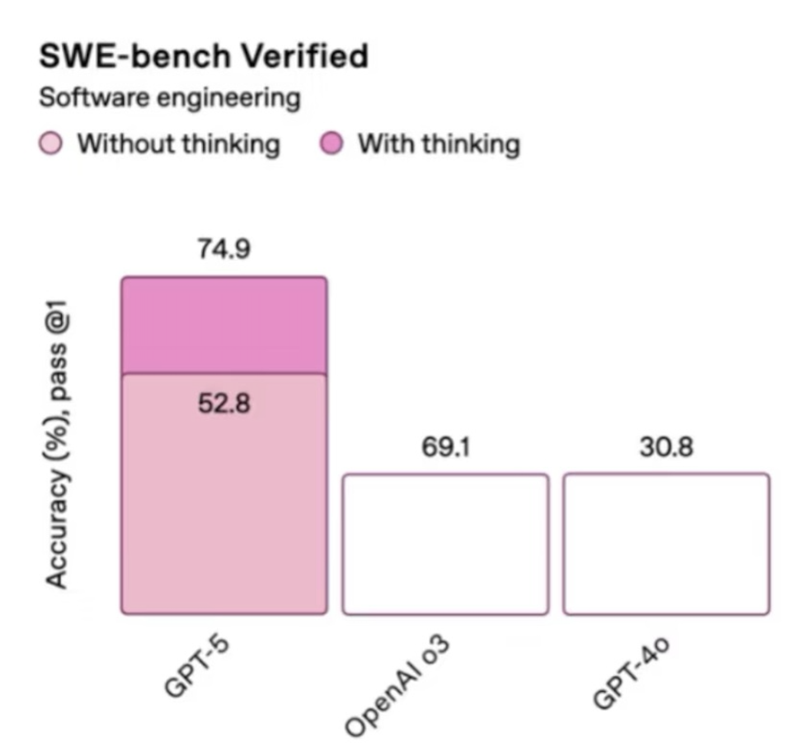

# 🎨 Day 3: Data Storytelling Adventures

*Today, Oda the magical data otter teaches us how to wrangle messy data and paint beautiful pictures with numbers! We'll become data detectives and storytellers!*

```{image} ../../images/viz.png
:alt: viz
:width: 50%
```
## 🎯 Learning Objectives

By the end of today, you'll be magical data wizards who can:
- 📂 Load real data from CSV files (like opening a treasure chest!)
- 🔧 Use data tools to clean and organize information
- 🌊 Chain commands together with the magical pipe operator
- 📊 Create three types of data stories: histograms, scatter plots, and bar charts
- 👥 Work as a team to solve real data mysteries

## 1. Ice Breaker: Mixed Treasure Bag Sorting Game
*Duration: 10 minutes*

🎈 **Activity: The Great Treasure Sort Competition**

Let's start with a treasure sort! Your team will get a bag of mixed treasures and a mission.


**What you'll need:** A bag or box of mixed items for each team (e.g., colorful tokens, different types of pens, beads, LEGO bricks).

**Your Mission:**
1. Form teams of 3-4 people. Each team gets one bag.
2. Empty your bag of treasures onto the table.
3. **Your challenge:** Work together to count how many items you have for each category. For example, your result might be "5 red tokens, 3 blue tokens, and 2 green LEGOs."
4. 🏆 The first team to get their counts **wins**!

#### 🤔 Team Reflection
*Once you have your counts, think about this:*
- What steps did your team take to complete the mission?
- Did you sort the items first? Why?

#### 💡 Connecting to Code
Guess what? The steps you took are the *exact* steps data wizards use to wrangle data with code!

- When you sorted items into piles (like all the red things together), you were performing a **`group_by()`** operation.
- When you counted the items in each pile, you were doing a **`summarize()`**.
- If we asked you to find *only the pens*, you would be using **`select()`**.

You just acted out a real data analysis workflow! Today, we'll teach you the spells to do this in R.

## 2. Let's Create Our Own Magical Creatures!
*Duration: 15 minutes*

🎈 **Activity: Become a Creature Creator**

Now it's your turn to add to our magical world! We're going to create a brand new dataset *together*, with creatures designed by YOU!

Your mission is to fill out this Google Form to invent your own magical creature. Be as creative as you like! 

After you submit, you can click "submit another response" to create even more creatures!

```
https://forms.gle/YmR896E9yC1Zva3KA
```


Here are the details you'll get to add about your creatures:

- What is your wizard name?
- What is your magical creature's name?
- What type of creature is it?
- How old is your creature (please enter number only)?
- On a scale of 1-10, how powerful is its magic?
- Does your creature have wings?
- What is its primary magical element?
- What superpower does this creature has?

**What happens next?**
Once everyone has submitted their creature, I will export the data and upload it to Posit Cloud as a new CSV file. Then, we will use our new data wrangling and visualization spells to explore the world we created together!

## 3. Data Loading Magic
*Duration: 15 minutes (plus Optional 10 minutes for Cleaning)*

### 3.1 Spell 1: Reading CSV Files
*Duration: 15 minutes*


#### 🎈 Activity: Opening Data Treasure Chests

##### 💡 What is a CSV file?
A CSV (Comma-Separated Values) file is like a super organized spreadsheet saved in a simple text format. Think of it as a list where every piece of information is separated by a comma. It's a bit like writing a list of your magical creatures and their powers:

```
Creature_Name, Type, Magic_Power
Sparkle, dragon, 10
Whiskers, fairy, 5
Thunder, phoenix, 9
```

R can easily read these files to bring data into our magical world!

##### 💡 Understanding File Paths - A Treasure Map for Your Computer!
Before we can load our data, we need to tell R exactly where to find it. Think of a file path as a treasure map that guides R to your file. There are two kinds of maps!

##### 📍 The World Treasure Map (Absolute Path):
This is like a full address that can find a treasure from anywhere in the world, but it only works for *one specific treasure chest*.
- **Example:** `C:/Users/Sky/Sky_documents/projects/datasets/creatures.csv`
- **What it means:** This path starts from the very beginning of Sky's computer's storage (`C:/`) and gives every single step to find the file.
- **Problem:** If I give this map to you, it won't work! Your computer doesn't have a folder called `Sky`, or `Sky_documents`. It's too specific to Sky's computer!

##### 🏴‍☠️ Your Secret Treasure Map (Relative Path):**
This is like a map that works from a starting point that you both know, the `projects` folder that you both have! 
- **Example:** `"datasets/creatures.csv"`
- **What it means:** "From right here inside our `projects` folder, go into the `datasets` folder, and you'll find the `creatures.csv` file."
- **Why it's better:** This map works for anyone who has the `projects` folder! When you share your project, your friend can use the same map to find the treasure on their computer.

🎯 **Always use relative paths in your R spells!** This way, your magic will work on any computer, not just your own.

🔍 Let's explore our magical creature data:

📁 **Find this spell in Posit Cloud:** Look for the file `day03_spell01_loading_data.R` in your project files!

```R
# Step 1: Load the treasure chest (read the data)
# We'll use the raw form data first (messy on purpose!)
creatures_raw <- read.csv("datasets/creature_of_sky.csv")

# For later, after we clean it, we'll use this:
# creature_data <- read.csv("datasets/creatures.csv")

# Step 2: Peek inside (look at first few rows)
head(creatures_raw)

# Step 3: Peek inside (look at last few rows)
tail(creatures_raw)

# Step 4: Count our treasures (check size)
nrow(creatures_raw)  # how many responses? (how many rows)
ncol(creatures_raw)  # how many details about each response? (how many columns)
dim(creatures_raw)   # how many rows and how many columns?
```

### 3.2 Spell 1B: Cleaning Real Data (Optional)
*Duration: 10 minutes (Optional)*


#### 🎈 Activity: Turn Messy Data into Magic

- Real data from Google Forms is often messy (typos, missing numbers, funny answers).


- We clean the data once, then use the clean file for all other spells.
##### 💡 What did we clean?
- Renamed long form questions to simple column names like `creature_name`, `creature_type`, `creature_age`, `magic_power`, `has_wings`
- Turned text data into real numbers (e.g., ages and magic power)
- Fixed `has_wings` answers to just `yes` or `no`
- Removed rows with missing or impossible values (like negative ages)

📁 **Find this spell in Posit Cloud:** Look for the file `day03_spell01B_clean_creatures.R` in your project files!

## 4. Data Wrangling Adventures
*Duration: 60 minutes*

### 4.1 Spell 2: The Ultimate Data Toolkit
*Duration: 20 minutes*

#### 🎈 Activity: Play with our own creatures!


📁 **Find this spell in Posit Cloud:** Look for the file `day03_spell02_data_wrangling.R` in your project files!

```R
# Load our data toolbox
library(dplyr)

# First, load your creature data (clean file from 3.2)
creature_data <- read.csv("datasets/creatures.csv")
```

```R
# SELECT: Pick only the name and type columns (choose features/columns)
creature_basics <- select(creature_data, creature_name, creature_type)
# Un-comment the code below to see the new dataframe
# creature_basics
```

**💡 What is `select()`?**
The `select()` spell is like choosing which characteristics about your creature you want to look at. Instead of trying to understand every aspect about every single creature at once (their name, age, type, power level, if they have wings), you might `select()` only 1 or a few characteristics to look at first. You might `select()` just the `creature_name` and `magic_power` to see who's the strongest. This chooses characteristics (columns) only — it **does not remove any creatures (rows)**; you are still looking at all the creatures but focusing on just their name and power. It helps you focus on only the columns you need and discard irrelevant information.

```R
# FILTER: Keep only creatures with wings (choose rows by a rule)
winged_creatures <- filter(creature_data, has_wings == "yes")
# Un-comment the code below to see the new dataframe
# winged_creatures
```

**💡 What is `filter()`?**
The `filter()` spell **keeps only the creatures (rows) that meet your rule**. You set a criterion on a characteristic (column), like `magic_power >= 80` or `type == "dragon"`. This does not change which characteristics (columns) you see — it **does not remove any characteristics (columns)**; it chooses which rows stay based on your threshold or criteria.

```R
# ARRANGE: Sort creatures by age (youngest first)
creatures_by_age <- arrange(creature_data, creature_age)
# Un-comment the code below to see the new dataframe
# creatures_by_age
```

**💡 What is `arrange()`?**
The `arrange()` spell is like lining up your creatures from shortest to tallest, or weakest to strongest. It sorts your data based on 1 or a few characteristics of the creatures. By default, `arrange()` sorts your data from smallest to biggest. Use `arrange(your_data, desc(column_name))` to sort from biggest to smallest.

```R
# SLICE: Get the top 3 oldest creatures (pick rows by position)
oldest_creatures <- arrange(creature_data, desc(creature_age))
top_3_oldest <- slice(oldest_creatures, 1:3)
# Un-comment the code below to see the new dataframe
# top_3_oldest
```

**💡 What is `slice()`?**
The `slice()` spell picks rows by their position in the table. It’s like choosing creatures from a lineup by their position in the queue. You can grab the first three with `slice(1:3)`, or just the tenth one with `slice(10)`.

### 4.2 Spell 3: Grouping and Mutating Magic
*Duration: 20 minutes*


#### 🎈 Activity: Sorting Creatures into Teams

📁 **Find this spell in Posit Cloud:** Look for the file `day03_spell03_grouping.R` in your project files!


```R
# GROUP BY and SUMMARIZE: Count each creature type and find their average power

# Step 1: Put creatures into teams by type
by_type <- group_by(creature_data, creature_type)

# Step 2: Ask each team for a report
creature_summary <- summarize(by_type,
                              how_many = n(),
                              average_power = mean(magic_power))
# Un-comment the code below to see the new dataframe
# creature_summary
```

**💡 What is `group_by()`?**
Think of `group_by()` like sorting your creatures into teams. All the dragons stand together, all the phoenixes together, and so on. This helps us compare teams easily.

**💡 What is `summarize()`?**
After the teams are made, `summarize()` asks each team one clear question and gets one clear answer back. For example: “How many are in your team?” or “What is your team’s average magic power?”

**💡 What are `n()` and `mean()`?**
- `n()` counts how many are in the team.
- `mean()` finds the average of a characteristic in the team (like what is the average `magic_power` of all creatures in the team).

Classify different creatures based on age:

```R
# Add a new column to label creatures as "young" or "old"
creatures_enhanced <- mutate(creature_data,
                             age_category = ifelse(creature_age > 100, "old", "young"))
# Un-comment the code below to see the new dataframe
# creatures_enhanced
```

**💡 What is `mutate()`?**
`mutate()` creates a brand-new column using the ones you already have. It’s like giving each creature a new label based on a rule.


### 4.3 Spell 4: Pipeline Magic
*Duration: 20 minutes*


#### 🎈 Activity: Chaining Commands Like Magic


📁 **Find this spell in Posit Cloud:** Look for the file `day03_spell04_piping.R` in your project files!

```R
# Without a pipe, you need lots of steps:
step1 <- filter(creature_data, creature_age > 50)
step2 <- select(step1, creature_name, creature_type, magic_power)
final <- arrange(step2, desc(magic_power))

# With a pipe, you can chain it all together:
magic_pipeline <- creature_data %>%
  filter(creature_age > 50) %>%
  select(creature_name, creature_type, magic_power) %>%
  arrange(desc(magic_power))

# Find the names of the top 3 most powerful winged creatures:
top_winged_creatures <- creature_data %>%
  filter(has_wings == "yes") %>%
  arrange(desc(magic_power)) %>%
  slice(1:3) %>%
  select(creature_name)
```

**💡 What is the Pipe `%>%`?**
The pipe `%>%` is one of the most magical spells in R! It lets you chain your commands together in a clear, readable way. It takes the result from the step before and "pipes" it directly into the next step.

**💡 `%>%` vs `|>` in R**
- `%>%` is from the `dplyr` R package. You get it when you load `dplyr`.
- `|>` is the base R pipe (built into R). It works even without loading packages.
- For our class, using `%>%` with `dplyr` is perfect. If you ever see `|>`, it’s doing the same kind of piping job.

Think of it like cooking a meal:
1. Take vegetables %>%
2. Add water %>%
3. Add spices %>%
4. Cook and serve


## 5. Data Storytelling with Pictures
*Duration: 45 minutes*

### 5.1 Spell 5: Histogram Stories
*Duration: 15 minutes*

#### 🎈 Activity: Shape Detective

**💡 What is a Histogram?**
A histogram is a picture that shows how your numbers are spread out. Imagine sorting creature ages into boxes (called bins): 0–10, 10–20, 20–30, and so on. Each bar tells you how many creatures are in each box. The bars touch because ages go in order with no gaps. This helps you see the overall shape — are most creatures young, old, or in-between?

📁 **Find this spell in Posit Cloud:** Look for the file `day03_spell05_histograms.R` in your project files!

```R
library(ggplot2)

# Create a histogram to see the shape of creature ages
ggplot(creature_data, aes(x = creature_age)) +
  geom_histogram(bins = 5, fill = "purple", color = "black") +
  labs(title = "How Old Are Our Magical Creatures?",
       x = "Age in Years",
       y = "Number of Creatures")
```

### 5.2 Spell 6: Scatter Plot Adventures
*Duration: 15 minutes*

#### 🎈 Activity: Relationship Detective

**💡 What is a Scatter Plot?**
A scatter plot is the perfect tool for a relationship detective! It helps you see if two things are connected. For example, does a creature who is older have more magic power? Each dot on the plot represents one creature, showing both their age and their magic level. If the dots form a pattern (like going up and to the right), it suggests a relationship!

📁 **Find this spell in Posit Cloud:** Look for the file `day03_spell06_scatter_plots.R` in your project files!

```R
# Look for a relationship between age and magic power
ggplot(creature_data, aes(x = creature_age, y = magic_power)) +
  geom_point(size = 3, color = "blue") +
  labs(title = "Do Older Creatures Have More Magic?",
       x = "Age in Years",
       y = "Magic Power Level")
```


### 5.3 Spell 7: Bar Chart Champions
*Duration: 15 minutes*

#### 🎈 Physical Activity: Human Bar Chart:**
- Teams line up behind their category signs
- The longest line "wins" - you can see the comparison instantly!

#### 🎈 Activity: Which group has the most creatures?

**💡 What is a Bar Chart?**
A bar chart is perfect for comparing different groups (categorical data). Each bar represents a group, and its height shows the count or value. It makes it super easy to see which group is the biggest! Which type of magical creature is most popular? A bar chart will tell you. 


📁 **Find this spell in Posit Cloud:** Look for the file `day03_spell07_bar_charts.R` in your project files!

```R
# Count each type of creature first
creature_counts <- creature_data %>%
  group_by(creature_type) %>%
  summarize(total = n())

# Create a bar chart
ggplot(creature_counts, aes(x = creature_type, y = total)) +
  geom_col(fill = "orange", color = "black") +
  labs(title = "Which Creature Type is Most Popular?",
       x = "Creature Type",
       y = "Number of Creatures")
```

**Histogram vs. Bar Chart: What's the Difference?**
- **Histograms** are for numbers that are continuous (like height, score)
- **Bar Charts** are for comparing separate groups or categories (like creature types: "dragon", "Fairy", "Phoenix").

#### 🤡 Visualization Crime Alert: Can You Spot What's Wrong?

Take a look at this real bar plot that was shared when GPT-5 was announced last week by OpenAI:



##### **🤔 What's wrong with this bar plot?**


## 6. Team Data Detective Project
*Duration: 35 minutes*

### 6.1 Spell 8: Data Mystery Solving
*Duration: 35 minutes*

📁 **Find this spell in Posit Cloud:** Start with `day03_spell08_team_project.R` (overview), then open ONE of:
- `day03_spell08A_creatures_project.R` (uses `creatures.csv`)
- `day03_spell08B_magical_pets_project.R` (uses `magical_pets.csv`)
- `day03_spell08C_creature_sightings_project.R` (uses `creature_sightings.csv`)
- `day03_spell08D_magic_school_project.R` (uses `magic_school_grades.csv`)

#### 🎈 Activity: Partner Data Investigation

**🕵️‍♀️ Mission: Solve a Data Mystery!**

Work with a partner to become data detectives! Choose one or many mysteries to solve using our creature datasets:

**Mystery Options:**
1. **Creature Power Mystery (creatures.csv):** Which creature type has the highest average magic power? Do winged creatures tend to be more powerful? Are older creatures more magical?
2. **Magical Pets Treat Mystery (magical_pets.csv):** Which favorite treat is most popular? Do pets who like that treat also tend to have higher magic levels?
3. **Creature Sightings Mystery (creature_sightings.csv):** Which location has the most creature sightings? What's the rarest creature spotted?
4. **Magic School Mystery (magic_school_grades.csv):** Which subject do students struggle with most? Who are the top students?

**Your Detective Tools:**
- Use `select()` to pick important clues
- Use `filter()` to focus on specific evidence  
- Use `slice()` and `arrange()` to find top/bottom performers
- Use `group_by()` and `summarize()` to count and calculate
- Create at least one visualization to show your findings

**🎯 Investigation Steps:**
1. Load your chosen dataset(s)
2. Explore it with `head()` and `str()`
3. Use data wrangling to find clues
4. Create a visualization to tell your story
5. Present your findings to the class!

✨ **Challenge:** Create the most creative visualization that clearly shows your discovery!


## 7. 📋 Pro Tips Cheatsheet

### Data Loading Essentials
- `read.csv("filename.csv")` opens data files like treasure chests
- `head(data)` shows first 6 rows (peek inside the chest)
- `tail(data)` shows last 6 rows (peek inside the chest)
- `nrow(data)` counts how many rows (how many creatures)
- `ncol(data)` counts how many columns (how many characteristics per creature)
- `dim(data)` counts both how many rows (first number), and how many columns (second number)
- Always check your data after loading it!
- Use relative paths like `"datasets/creatures.csv"` so your code works on any computer.

### Data Wrangling with dplyr
- `library(dplyr)` loads an open-source R package with code written by someone else (don't forget this!).
- `select(data, column1, column2)` picks specific columns.
- `filter(data, condition)` keeps only rows that match a rule.
- `arrange(data, column)` sorts your data (use `desc()` for biggest first).
- `slice(data, 1:5)` picks specific rows by their position.
- `group_by(data, category)` sorts your data into teams.
- `summarize(count = n())` calculates a summary for each team (like counting or averaging).
- `mutate(data, new_col = calculation)` creates new columns.

### Data Cleaning Essentials (from Spell 1B)
- `rename()` shortens long column names to simple ones (lowercase)
- `as.numeric()` turns number-like text into real numbers
- `gsub()` removes unwanted characters from text before converting
- `ifelse()` helps create clean categories like `yes`/`no`
- `filter()` removes rows with missing or impossible values
- `write.csv()` saves your cleaned data for everyone to use

### Pipeline Magic
- `%>%` means "then do this next", from `dplyr` package
- `|>` also means "then do this next", from base R (do not need to load packages), most of the time it's interchangable with `%>%`
- `data %>% filter() %>% select() %>% arrange()` chains commands together
- Read like instructions: "take data, then filter, then select, then sort"

### Visualization Basics with ggplot2
- `library(ggplot2)` loads your plotting toolbox (ggplot2 R package).
- `geom_histogram()` creates histograms, shows the shape of numbers (for continuous data).
- `geom_point()` creates scatterplots, shows relationships between two variables (characteristics of each data point).
- `geom_col()` creates bar plot, compares different categories (for categorical data).
- Add titles and labels with `labs(title = "My Title")`.
- Use `color =` or `fill =` to make your plots colorful and easier to understand.

## 8. 🆘 Troubleshooting Cheatsheet

### Data Loading Problems
🐛 **Error: "cannot open file"**
- **What it means:** R can't find a way to walk to your file
- **Why it happens:** File name is wrong or file isn't where you think it is (path is wrong)
- **The Fix:** Check that `creatures.csv` exists in datasets folder, check spelling exactly

🐛 **Error: "`creature_data` object not found"**
- **What it means:** You're trying to use `creature_data` but it doesn't exist
- **Why it happens:** Forgot to run the code that loads your creature data
- **The Fix:** Run the `creature_data <- read.csv("datasets/creatures.csv")` line first

### Function Problems
🐛 **Error: "could not find function"**
- **What it means:** R doesn't know what `select()` or `filter()` means
- **Why it happens:** Forgot to load the dplyr package
- **The Fix:** Run `library(dplyr)` or `library(ggplot2)` first

🐛 **Error: "object 'creature_name' not found"**
- **What it means:** Column name (`creature_name`) doesn't exist in your creature data
- **Why it happens:** Typo in column name or your columns are named differently
- **The Fix:** Check column names with `names(creature_data)` and fix spelling

### Pipeline Problems
🐛 **Pipeline not working**
- **What it means:** Something wrong in the chain of `%>%` commands
- **Why it happens:** Forgot to load dplyr, or syntax error in pipeline
- **The Fix:** Load `library(dplyr)` first, test each step separately

### Plotting Issues
🐛 **"continuous value supplied to discrete scale"**
- **What it means:** Trying to color by a number when ggplot expects categories
- **Why it happens:** Using `color = creature_age` instead of `color = creature_type`
- **The Fix:** Use categorical variables (like creature_type) for colors

---

💡 **Remember:** It's ok to get errors, even your instructor still get error every day! That's how we leran and grow to be better data scientists!