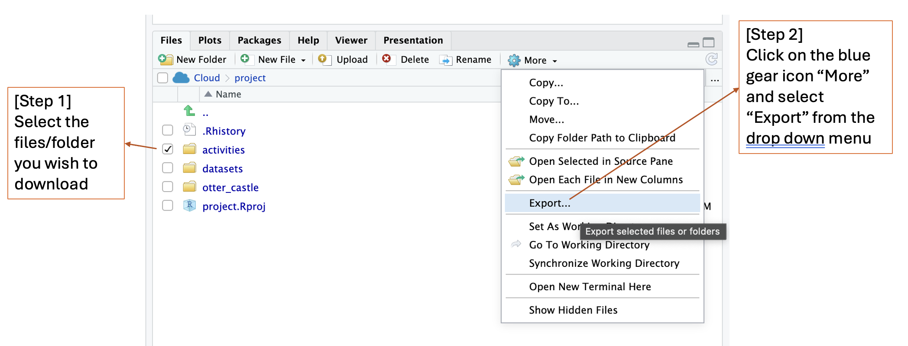
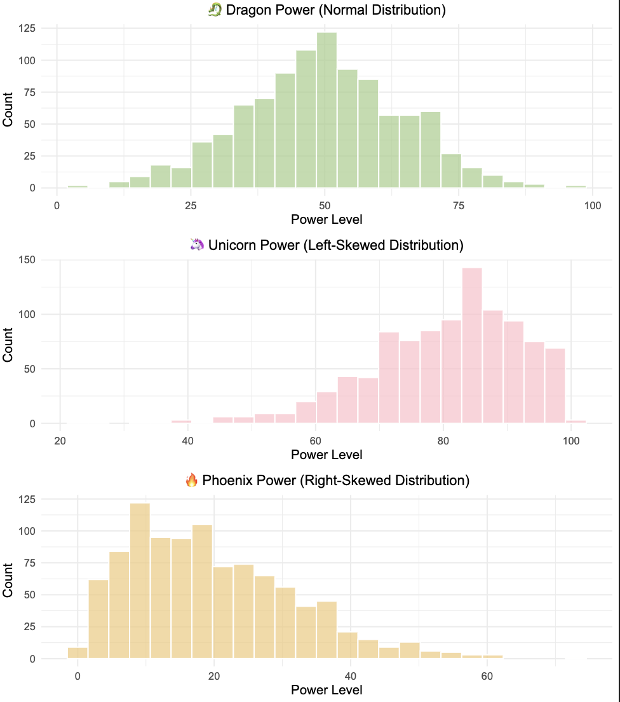
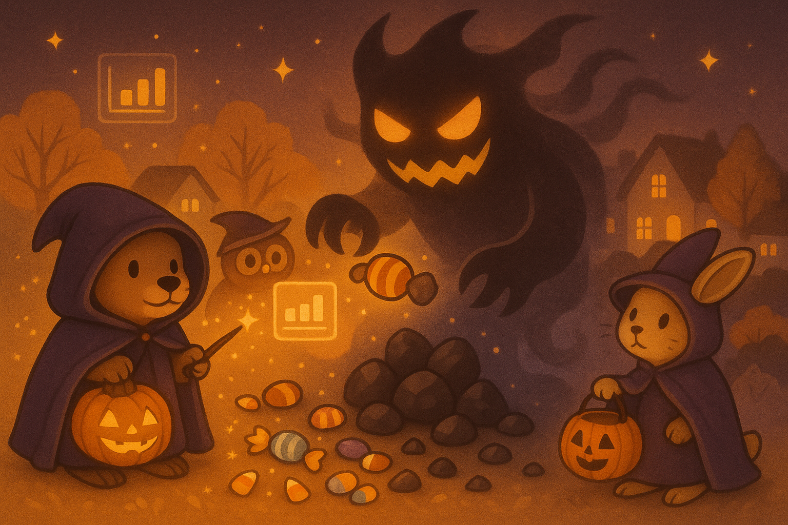
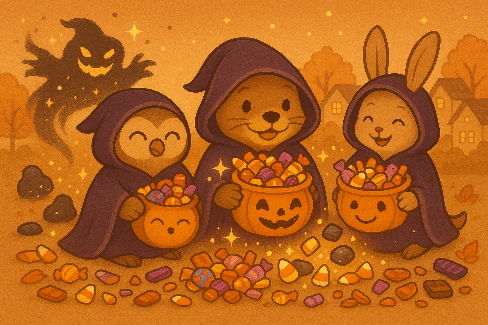
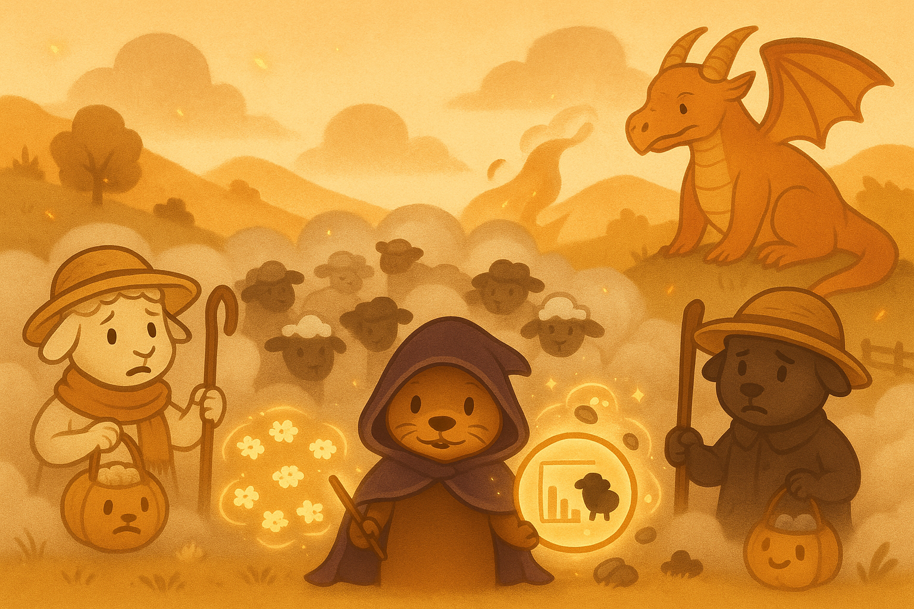

# 🌲 Day 4: Statistics Enchanted Forest

*Join Oda the Data Otter as she explores the enchanted Statistics Forest, where magical creatures reveal the secrets of mean, median, sampling, and bootstrap magic through epic adventures and mystical challenges!*

```{image} ../../images/stat.png
:alt: stat
:width: 50%
```

### 🎯 Learning Objectives
- 📊 Become human data points and discover mean, median, and mode through the "Human Histogram" adventure
- 🔍 Master distribution detective skills to identify symmetrical, left-skewed, and right-skewed data patterns
- 🎲 Understand the difference between populations and samples through magical creature studies
- 📏 Discover how sample size affects the reliability of our statistical conclusions
- 🎃 Experience sampling variability through the Halloween candy discovery adventure 
- 🐑 Learn bootstrapping magic by rescuing sheep from dragon fire
- 🎯 Build confidence intervals to make educated guesses about unknown populations


> ✨ Extra Challenge (Optional)
> 
> - Ready for something more challenging? Try these extra challenging scripts in [Posit Cloud](https://posit.cloud)!:
>   1. Work through the extra challenging worksheet `activities/day04_extra_challenge.Rmd`.
> - If you get stuck, reach out to your instructor for help!


## 📥 How to Download Your Folder/Files from Posit Cloud

Follow these quick steps to save your work to your computer:

1. In Posit Cloud, open the Files pane (bottom-right).
2. Click the checkbox next to the folder or files you want (for example, `day04/` or a single `.Rmd`).
3. Click More (with blue gear icon) → Export.
4. A `.zip` file will download with your selected items.



💡 Pro tip: If you don’t select anything, Export will download the current folder you’re viewing.

## 1. 🎈 Ice Breaker Activity: Human Histogram & Statistics Discovery
*Duration: 30 minutes*

🎉 Today, YOU become the data points! We'll use our own heights and birthdays to discover the magic of mean, median, and mode.

### 1.1 Height Histogram & Mean Discovery
*Duration: 20 minutes*

1. **🧙‍♀️ Human Lineup:** Line up by height from shortest to tallest
2. **🔍 In-Person Investigation:** 
   - Find the shortest wizard (minimum)
   - Find the tallest wizard (maximum) 
   - Find the middle wizard (median) - count from both ends!
3. **📝 Data Collection:** Enter your wizard name and height into our magical data form: 
https://forms.gle/TG2dgNwknN6KGTcE6
4. **📏 What if I don't know my height?:** 
    - Try to give a guess about your height using reference objects or people around you. 
        - For example, a regular paper is 21 cm in width and 30 cm in height. 
        - Your instructor Sky is 175 cm tall.
5. **🧮 Calculate Our Class Mean Height:** We'll add up everyone's heights and divide by the number of wizards in our class
6. **💻 R Magic Verification:** Watch as we put your data into R and compare our human results with computer calculations!

**🤔 Why Do We Care About Mean?**
- The mean tells us what a "typical" wizard in our class looks like!
- Other examples of using **Mean**:
    - 🌡️ **Weather Wizard:** Weather apps use mean temperature to tell you if it's a hot or cold month
    - 🏀 **Sports Star:** Basketball players track their mean points per game to see how good they are
    - 🍕 **Pizza Party Planning:** If you know the mean number of pizza slices each friend eats, you can order the right amount!

### 1.2 Birthday Block Building & Mode/Median Discovery
*Duration: 15 minutes*

1. **🧱 Block Distribution:** Each wizard gets one block
2. **📅 Month Stations:** Set up 12 month stations at the front of the classroom  
3. **🏗️ Building Together:** Place your block on your birth month pile
4. **💻 R Data Collection:** As each wizard places their block, we'll enter their birth month into our R list
5. **📊 Visual Discovery:** Watch our classroom histogram grow in real-time!
6. **🔍 Statistical Magic:** 
   - Find the **mode** (tallest stack = most popular month)
   - Calculate the **mean** month using R
7. **🤔 Pattern Spotting:** Which months are popular? Any empty months?

💡 **Pro Tips:** Different types of data need different measures!
- **Mean** = Add everyone's height up and divide by total number of students in the class
- **Median** = Middle detective in a lineup of counts
- **Mode** = Most popular birthday month in the room

**🤔 Why Do We Care About Median?**
- The median shows us the "middle" value that splits our data in half!
- Other examples of using **Median**:
    - 🏠 **House Prices:** When some houses cost millions and others cost thousands, median gives a better "typical" price than mean
    - 🍎 **Test Scores:** Median helps teachers see how the "middle" student performed, not affected by super high or low scores. This helps teachers to see how well the class in general understands a new concept.

**🤔 Why Do We Care About Mode?**
- The mode tells us what happens most often - the most popular choice!
- Other examples of using **Mode**:
    - 👕 **T-Shirt Sizes:** Stores need to know which size sells most (mode) to stock the right amounts
    - 🍦 **Ice Cream Flavors:** Ice cream shops track which flavor is ordered most often to plan their inventory


## 2. Distribution Detective Mission 🔍
*Duration: 35 minutes*

### 2.1 The Shape of Data Magic
*Duration: 5 minutes*

💡 **What are Data Distributions?**
Just like how people can be tall, short, or in-between, data comes in different shapes! Some data is perfectly balanced (symmetrical), some leans to one side (skewed), and some has unusual outliers that surprise us.

**Today's Mission:** Investigate three magical creature types with completely different distributions!

### Spell 1: Distribution Detective Investigation  
*Duration: 30 minutes*

#### 🎈 Activity: The Three Magical Distribution Mysteries

**🐉 Mystery 1: Dragon Power (Symmetrical Distribution)**
- Most dragons have medium power
- Few dragons are very weak or very strong
- Mean and median are best friends (very close together)!

**🦄 Mystery 2: Unicorn Magic (Left-Skewed Distribution)**  
- Most unicorns have high magic
- A few unicorns have very low magic (creates a "tail" on the left)
- Mean gets "pulled down" by the low values

**🔥 Mystery 3: Phoenix Energy (Right-Skewed Distribution)**
- Most phoenixes have low energy  
- A few phoenixes have extremely high energy (creates a "tail" on the right)
- Mean gets "pulled up" by the high values

📁 **Find this spell in Posit Cloud:** Look for the file `day04_spell01_distribution_detective.Rmd` in your project files!

**🔍 Detective Challenge Questions:**
1. Which creature type has mean and median closest together? Why?
2. Which creature type shows the biggest difference between mean and median?
3. When data is skewed, which is better to use: mean or median?


💡 **Detective Rules:**
- **Symmetrical data:** Mean ≈ Median (use either one!)
- **Left-skewed distributions:** Mean < Median (mean gets pulled down because of outliers with small values sitting on the left side)
- **Right-skewed distributions:** Mean > Median (mean gets pulled up because of outliers with large values sitting on the right side)
- **When data is skewed,** median is often a better measure of "typical" value
- **Outliers:** Can pull the mean away from where most data sits



## 3. 🎲 The Great Sampling Adventure 
*Duration: 65 minutes*

### 3.1 Understanding Populations vs Samples
*Duration: 5 minutes*

💡 **The Big Picture:**
Imagine you want to know what percentage of creatures in the entire Enchanted Forest are dragons, but you can't count all million creatures! So you explore small areas and use those to make educated guesses.


- **🌲 Population** = All creatures in the entire Enchanted Forest (everything we want to know about)

- **🔍 Sample** = The creatures we find in one small area (the small group we actually study)

- **🎯 Parameter** = The true characteristic of the entire population (like "exactly 30% of all forest creatures are dragons")

- **📊 Statistic** = Something we calculate from our sample (like "25% of creatures in our sample are dragons")

- **🎯 Inference** = Using our sample to make conclusions about the whole population, knowing how uncertain we are

### 3.2 Game 1: The Enchanted Halloween Neighborhood Mystery 🎃
*Duration: 25 minutes*

#### 3.2.1 🎈 Activity: Statistical Wizards Save Halloween

**📖 The Story:**

The Mgaic Council of Halloween has received reports that the Shadow Monster has been cursing neighborhoods, turning precious candies into worthless shadow stones! As young Statistical Wizards, your mission is to determine if the **Enchanted Forest Neighborhood** is safe for trick-or-treating.



**⚡ The Challenge:** 

The neighborhood has a magical protection spell - if it contains 80% or more real candies (not shadow stones), it's safe to visit. But beware! You only have **3 minutes of magical sight** to examine your sample before the spell fades.

**🧙‍♀️ The Mgaic Council Has Prepared:**

- "Time Crystal Bag" containing 10 items each (Mix of wrapped candies and shadow stones)
- Timer will be set to 3 minutes for **magical sighting**
- Magical google Form for data collection
    - URL: [https://forms.gle/pVVK2zBVovA1637Z9](https://forms.gle/pVVK2zBVovA1637Z9)
    - Enter "how many candies are in your bag" after you finish counting

**🪄 You will get:**

- Everyone gets one "Time Crystal Bag" containing 10 items

**⚡ The Magic Rules:**

1. **Incantation Phase:** Kids chant "Statistical powers, reveal the truth!" before opening their bags
2. **Counting Phase:** 5 minutes to count candies vs. shadow stones
3. **Decision Phase:** Each wizard declares if they think the neighborhood is "SAFE" or "CURSED"
4. **Data Crystal Phase:** Enter candy count, and your decision into the magical Google Form: [https://forms.gle/pVVK2zBVovA1637Z9](https://forms.gle/pVVK2zBVovA1637Z9)

💡 **The Magic Discovery:** Different samples give different results! This is called **sampling variability** - and it's totally normal!


#### 3.2.2 💡 Pro Tips: Understanding Sampling Magic
*Duration: 5 minutes*

**🎯 What is a Sampling Distribution?**
Remember our candy bag game? Imagine if 100 different kids each got their own "Time Crystal Bag" with 10 items from the same magical neighborhood. Each kid counts their candies and gets a different result - maybe 6 candies, 8 candies, 7 candies, etc. If we collected ALL 100 results and made a graph showing how many kids got 6 candies, how many got 7, etc., that graph is called a **sampling distribution**! It shows us the pattern of what happens when **lots of samples** are taken from the same **population**.

**📊 What is Spread (Variability)?**
Spread tells us how "spread out" or scattered our data points are:
- **Small spread**: All your data points are close together (like 28%, 30%, 32% candies)
- **Large spread**: Your data points are far apart (like 15%, 30%, 45% candies)
- **Magic Rule**: Larger samples = smaller spread = more reliable results!

**🧮 What Does the Mean of the Sampling Distribution Tell Us?**
Here's the coolest part about our candy bag game! Let's say the magical neighborhood REALLY has 80% candies (that's the truth). If 100 kids each count their bags, some might get 6 candies, some 8, some 7, etc. But here's the magic: if you add up ALL their candy counts and find the average, you'll get very close to 8 candies (which equals 80%)! Even though each kid got different results, when we combine everyone's results, we get closer to the truth about the neighborhood!

**🔍 Real-Life Example:**
If the true percentage of dragons in the forest is 30%, and you take 100 different samples:
- Some samples might give you 25% dragons
- Some might give you 35% dragons  
- But the AVERAGE of all 100 sample percentages will be very close to 30%!


#### 3.2.3 🎈 Activity: Statistical Wizards Save Halloween - Round 2!!
*Duration: 25 minutes*

> 🎉 Good News! The magical council has prepared more "Time Crystal Bag" for us!



**🪄 You will get:**

- Everyone gets 2 more "Time Crystal Bag"

**⚡ The Magic Rules:**

1. **Incantation Phase:** Kids chant "Statistical powers, reveal the truth!" before opening their bags
2. **Counting Phase:** 5 minutes to count candies vs. shadow stones
3. **Decision Phase:** Each wizard declares if they think the neighborhood is "SAFE" or "CURSED"
4. **Data Crystal Phase:** Enter candy count, and your decision into the magical Google Form: [https://forms.gle/dwMLreYBN4CHmWwh8](https://forms.gle/dwMLreYBN4CHmWwh8)

**🏆 Rewards & Competition:**

- **Prediction Points:** Kids who make the right prediction earn **EXTRA CANDY!**


#### 3.2.4 🎈 Activity: The Magical Creature Population Study
*Duration: 20 minutes*

**🐉 The Setup:** In the Enchanted Forest, we have a population of 1000 magical creatures where exactly 30% are dragons. Let's see what happens when we take different sized samples!

📁 **Find this spell in Posit Cloud:** Look for the file `day04_spell02_sampling_adventure.Rmd` in your project files!

**🔬 The Three Great Experiments:**
1. **Small Samples (Size 10):** Take 100 samples of 10 creatures each
2. **Medium Samples (Size 50):** Take 100 samples of 50 creatures each  
3. **Large Samples (Size 100):** Take 100 samples of 100 creatures each

**🎯 Key Discoveries:**
- All sample sizes give averages close to the truth (30% dragons)
- Larger samples are more reliable
- Sampling distributions form beautiful bell shapes!
- The **spread** decreases as sample size increases

💡 **The Magic Moment:** When we increase sample size, we make our estimates much more reliable!

## 4. 🐑 The Great Dragon Fire Sheep Rescue
*Duration: 65 minutes*

### 4.1 Understanding Bootstrap Magic & Confidence Prophecies
*Duration: 5 minutes*

💡 **The Big Picture:**
Imagine you're a shepherd trying to count sheep in a thick fog! You can only see a small group at a time, but you need to know about the entire flock. Bootstrap magic lets you use your small sample to imagine what hundreds of other samples might look like!


- **🐑 Bootstrap Magic** = Using your small sheep sample to create hundreds of "pretend samples" with replacement

- **🎯 Confidence Prophecy** = Your estimate range: "I'm 90% confident the true percentage is between X% and Y%"

- **🔮 The Magic Hat Rule** = Always put the sheep back! (sampling WITH replacement)

- **🎯 Inference Goal** = Use your small flock sample to make educated guesses about the entire meadow

### 4.2 Game 1: The Great Dragon Fire Sheep Rescue 🐑🔥
*Duration: 30 minutes*

#### 4.2.1 🎈 Activity: Bootstrap Magic & Confidence Prophecies

**📖 The Story:**

**URGENT QUEST ALERT!** The ancient Dragon of Mount Statistics has accidentally breathed fire across the Enchanted Meadows, where Farmer Luna (white sheep) and Farmer Obsidian (black sheep) graze their magical flocks. The fire didn't harm the sheep, but created a massive cloud of magical smoke that mixed all the flocks together!

The two farmers are worried and need to know how many of their sheep are mixed together in the smoky field. But here's the problem: the smoke is so thick that shepherds can only see a small group of sheep at a time, and all the water was used to put out the fire, so they can't wash the sheep to see their true colors clearly!



**⚡ The Challenge:**

As Junior Statistical Shepherds, you must use the ancient art of **Bootstrap Magic** to estimate what percentage of the total flock is black sheep, and create a **Confidence Prophecy** (confidence interval) for your estimate.

**🧙‍♀️ The Shepherd's Council Has Prepared:**

- "Smoke Sample Bags" containing black and white tokens (representing sheep)
- Each bag has the same true proportion (60% black, 40% white)
- Small containers for bootstrap resampling
- Timer for the rescue mission
- Magical Google Form for Confidence Prophecy submissions
- "Shepherd's Badge" stickers for successful rescuers

**🪄 You will get:**

- Everyone gets one "Smoke Sample Bag" containing 15-20 tokens

**⚡ The Rescue Rules:**

1. **Incantation Phase:** Shepherds chant "Bootstrap powers, reveal the flock!" before opening their bags
2. **Initial Vision Phase:** Count black vs. white sheep in your original sample (5 minutes)
3. **Bootstrap Prophecy Phase:** Use magic hat sampling to create 8-10 pretend samples (10 minutes)
4. **Confidence Prophecy Phase:** Calculate your 90% confidence interval for black sheep percentage
5. **Royal Registry Phase:** Enter your confidence prophecy into the magical Google Form

💡 **The Rescue Discovery:** Your confidence prophecy shows how uncertain your estimate is - this is statistical honesty!


#### 4.2.2 💡 Pro Tips: Understanding Bootstrap Magic
*Duration: 5 minutes*

**🎯 What is Bootstrapping?**
You can only see 20 sheep through the smoke, but you want to know what the whole flock looks like. Bootstrapping is like having a magic hat - you put your 20 sheep in the hat, pull one out, write down its color, PUT IT BACK, then do it again! You do this 20 times to create a "pretend new sample". By doing this magic trick hundreds of times, you can imagine what it would be like if you could take hundreds of real samples from the field!

**🎯 What is a Confidence Interval?**
🎯 **Your Confidence Prophecy!** After doing the bootstrap magic many times, you notice that most of your "pretend samples" gave you black sheep percentages between 40% and 80%. So you tell the farmers: "I'm 90% confident that between 40% and 80% of your mixed flock is black sheep!" It's like saying "I'm pretty sure the answer is somewhere in this range, but I can't be 100% certain because I could only see a small part through the smoke."

**🔍 Real-Life Bootstrap Examples:**
If you want to know the average height of all kids in your school but can only measure 30 kids:
- Bootstrap lets you use those 30 kids to create hundreds of "pretend samples"
- Each pretend sample gives you a different average height
- The range of those averages becomes your confidence interval!

#### 4.2.3 🎈 Activity: The Grand Shepherd Revelation & Rewards
*Duration: 25 minutes*
> 🎉 The Oracle is ready to reveal the truth about the flock! Time for the grand celebration!

**🏆 Competitive Elements & Rewards:**

- **Prophecy Accuracy Award:** Whose confidence interval captures the true value? **WIN EXTRA CANDY!**
- **Precision Prize:** Narrowest confidence interval that still captures the truth gets **BONUS TREATS!**
- **Team Oracle Challenge:** Everyone who participates gets candy, and the group celebrates their combined statistical power!

**⚡ The Grand Revelation Rules:**

1. **Prophecy Sharing Phase:** Each shepherd announces their confidence interval
2. **Oracle Revelation Phase:** The instructor reveals the true population percentage
3. **Victory Celebration Phase:** Crown the Statistical Shepherds whose confidence intervals captured the true value!
4. **Learning Reflection Phase:** Discuss why some prophecies missed and others hit

**🔍 Spell 3: Bootstrap Bootcamp - R Edition**

📁 **Find this spell in Posit Cloud:** Look for the file `day04_spell03_bootstrap_bootcamp.Rmd` in your project files!


## 5. 📋 Pro Tips Cheatsheet

### 🕵️ Detective Skills (Central Tendency)
- **Mean**: Add up all values and divide by count (best for symmetrical data)
  - 🌡️ Example: Weather apps use mean temperature for monthly averages
- **Median**: Line up values from smallest to largest, find the middle one (best for skewed data)
  - 🏠 Example: House prices use median because a few expensive houses don't skew the "typical" price
- **Mode**: The value that appears most often (best for categories)
  - 👕 Example: Stores track which t-shirt size sells most (mode) to stock inventory
- **Detective Memory**: Mean = sharing equally, Median = middle detective, Mode = most popular choice

### 📊 Distribution Shape Detective Rules
- **Symmetrical Distribution**: Mean ≈ Median (like Dragon Power - balanced!)
- **Left-Skewed Distribution**: Mean < Median (like Unicorn Magic - mean pulled down by low outliers)
- **Right-Skewed Distribution**: Mean > Median (like Phoenix Energy - mean pulled up by high outliers)
- **Skewness Detective Tip**: When data is skewed, median is often better than mean for finding "typical" values
- **Outlier Alert**: Extreme values can pull the mean away from where most data sits

### 🎲 Sampling Wisdom (Population vs Sample)
- **🌲 Population**: All creatures in the entire Enchanted Forest (everything we want to know about)
- **🔍 Sample**: The creatures we find in one small area (the small group we actually study)
- **🎯 Parameter**: The true characteristic of the entire population (like "exactly 30% of all forest creatures are dragons")
- **📊 Statistic**: Something we calculate from our sample (like "25% of creatures in our sample are dragons")
- **🎯 Inference**: Using our sample to make educated guesses about the whole population
- **Sampling Variability**: Different samples give different results - that's totally normal!
- **Sample Size Magic**: Larger samples = smaller spread = more reliable results = closer to truth

### 🎃 Sampling Distribution
- **What it is**: The pattern you see when lots of samples are taken from the same population
- **Central Limit Theorem**: The average of many sample results gets very close to the true population value
- **Spread Rule**: Larger sample sizes create sampling distributions with smaller spread (more reliable!)
- **Bell Shape**: Sampling distributions often form beautiful bell curves
- **Magic Truth**: Even though individual samples vary, their average leads to the truth!

### 🐑 Bootstrap Magic Tricks (Dragon Fire Sheep Rescue)
- **🔮 The Magic Hat Rule**: Always PUT THE SHEEP BACK! (sample WITH replacement)
- **Bootstrap Power**: Your small sample can create hundreds of "pretend samples"
- **Bootstrap Purpose**: Shows how much your estimate might vary if you took many samples
- **Key Discovery**: Bootstrap lets you estimate uncertainty when you only have one sample
- **Real Magic**: Use your sample to imagine what hundreds of other samples might look like

### 🎯 Confidence Prophecy Magic (Confidence Intervals)
- **90% Confidence**: "I'm 90% confident the true percentage is between X% and Y%"
- **95% Confidence**: More confident, but need a wider range to be safer
- **99% Confidence**: Very confident, but need a very wide range
- **Prophecy Wisdom**: Higher confidence level = wider interval = safer prediction
- **Statistical Honesty**: Confidence intervals show how uncertain we are - that's good science!
- **Capture Rate**: If you make 100 confidence intervals, about 90 of them should capture the true value (for 90% confidence)

### R Magic Commands
```r
# Load the magical packages first!
library(infer)                         # For rep_sample_n bootstrap magic
library(ggplot2)                       # For beautiful visualizations

# Human histogram detective tools
mean(wizard_heights)                   # Calculate class average height
median(wizard_heights)                 # Find middle wizard height
table(birth_months)                    # Count wizards born in each month
min(wizard_heights)                    # Find shortest wizard
max(wizard_heights)                    # Find tallest wizard

# Distribution detective spells
hist(dragon_power)                     # Create histogram to see data shape
summary(creature_data)                 # Get mean, median, min, max all at once

# Sampling adventure magic
rep_sample_n(magical_creatures, size = 10)  # Take one sample of 10 creatures
rep_sample_n(magical_creatures, size = 10, replace = FALSE, reps = 1000) # Take 1000 different samples of 10 creatures each --> SAMPLING DISTRIBUTION
sample(population, size = 50, replace = FALSE)  # Sample without replacement

# Bootstrap sheep rescue magic
rep_sample_n(sheep_sample, size = 20, replace = TRUE, reps = 1000)  # Bootstrap magic
quantile(bootstrap_results$black_proportion, c(0.05, 0.95))  # 90% confidence prophecy
quantile(bootstrap_results$black_proportion, c(0.025, 0.975))  # 95% confidence prophecy

```

## 6. 🆘 Troubleshooting Cheatsheet

### Game Day Troubleshooting

**🐛 "My team's candy counts don't match others!"**
- **What it means:** Different samples give different results
- **Why it happens:** This is sampling variability - totally normal!
- **The Fix:** No fix needed - this is the magic of statistics!

**🐛 "I forgot to put the sheep back in the magic hat!"**
- **What it means:** You broke the bootstrap magic rule (sampling without replacement)
- **Why it happens:** Excitement and rushing during the sheep rescue
- **The Fix:** Start that bootstrap round over, always PUT THE SHEEP BACK!

**🐛 "Our confidence prophecy missed the true sheep percentage!"**
- **What it means:** Sometimes prophecies don't capture the truth
- **Why it happens:** That's why it's called 90% confidence, not 100%!
- **The Fix:** This is normal! 10% of the time shepherds' prophecies will miss.

**🐛 "The Google Form won't take my data!"**
- **What it means:** Data format might be wrong
- **Why it happens:** Numbers entered as text or missing values
- **The Fix:** Check that you're entering numbers only, no letters

**🐛 Error: "could not find function rep_sample_n"**
- **What it means:** You forgot to load the infer package
- **Why it happens:** Skipped the library(infer) command
- **The Fix:** Run `library(infer)` before using rep_sample_n

**🐛 "My bootstrap results are all the same!"**
- **What it means:** You might be sampling without replacement
- **Why it happens:** Forgot `replace = TRUE` in rep_sample_n
- **The Fix:** Make sure to use `replace = TRUE` for bootstrap magic
